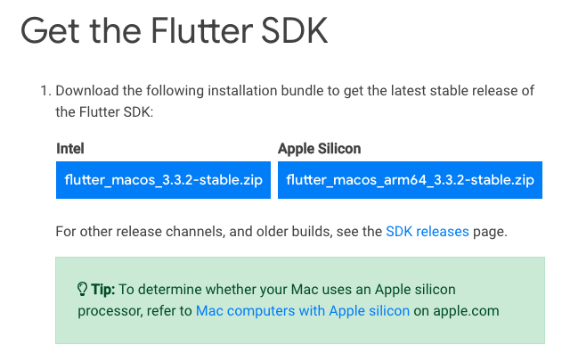
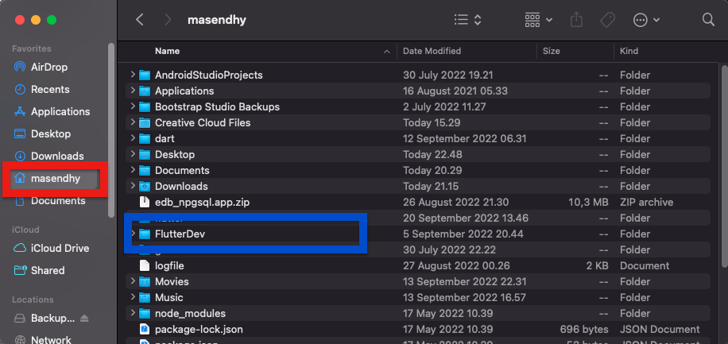
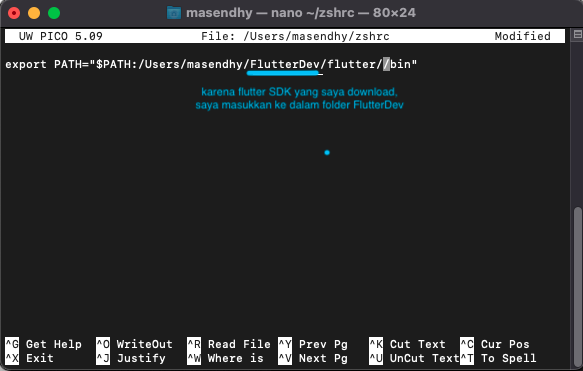
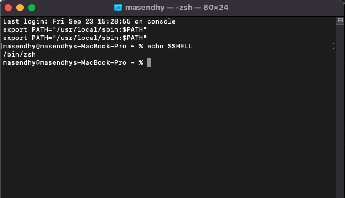
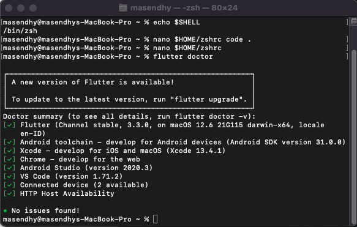
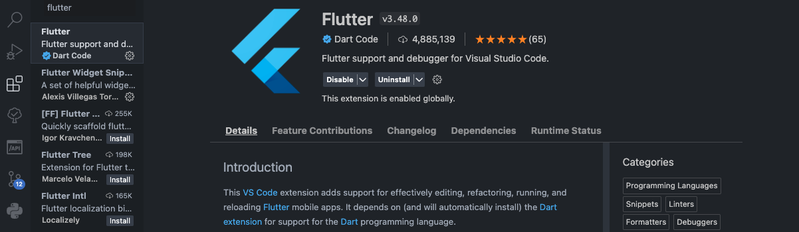

1. Silahkan kunjungi :

   > https://docs.flutter.dev/get-started/install

   pilih sistem operasi sesuai dengan device milik temen-temen, pada kesempatan kali ini saya akan memberikan contoh instalasi pada macOS

2. Berikut sistem requirements yang dibutuhkan :

   - Disk Space minimal 2.8 GB

3. Install git jika temen-temen belum memilikinya, karena kita akan melakukan installasi melalui git, dan di rekomendasikan untuk menginstall Xcode (download melalui App Store) karena sudah terdapat git dan SDK yang akan kita butuhkan saat menjalankan aplikasi **Flutter**.

   - Bagi temen-temen pengguna Apple Silicon Mac silahkan install Rosetta translation environment terlebih dahulu.

   ```zsh
   sudo softwareupdate --install-rosetta --agree-to-license
   ```

4. Download **Flutter SDK** sesuai dengan sistem operasi macOS milik temen-temen.

   

   - Setelah berhasil didownload, pindahkan root disarankan untuk dipidahkan ke Home directory (terdapat icon rumah)

   

5. Update path untuk menambahkan **Flutter** path secara permanen.

   

   **Cara nya :**

   - cek terlebih dahulu terminal temen-temen dengan mengetikkan

   ```zsh
   echo $SHELL
   ```

   

   - disini berarti laptop saya menggunakan zsh shell

   * masuk ke dalam zshrc nya

   ```zsh
   nano $HOME/zshrc
   ```

   - tambahkan path **Flutter** sesuai dengan path milik temen-temen (tempat folder bin pada flutter SDK yang telah di download )

   ```zsh
   export PATH="$PATH:[PATH_OF_FLUTTER_GIT_DIRECTORY]/bin"
   ```

   setelah dirubah menjadi seperti ini :

   

   - jalankan path tadi dengan mengetik di terminal

   ```zsh
   source $HOME/.zshrc
   ```

   - kemudian test dengan menjalankan

   ```zsh
   flutter doctor
   ```

   

   - pada terminal saya terlihat sudah check list hijau semua karena, laptop saya sudah melakukan installasi secara lengkap, bagi temen-temen yang masih terdapat catatan merah pada laptopnya, tidak perlu khawatir kita akan bereskan bersama.

6. Membenahi error xcodebuild -license pada terminal, jalankan perintah ini di terminal :

   ```zsh
   sudo xcodebuild -license
   ```

7. Membenahi error Android Studio dan SDK nya

   - download kemudian install android studio nya melalui :

     **[https://developer.android.com/studio](https://developer.android.com/studio)**

   - setelah berhasil installasi android studio, lakukan install SDK Manager melalui android studio yang telah diinstall tadi.

   * lakukan agreement android license, ketik pada terminal :

   ```zsh
   --android-licenses
   ```

8. Membenahi error cocoapods

   - download cocoapods, ketik pada terminal

   ```zsh
   sudo gem install cocoapods
   ```

9. Membenahi error VS Code

   - download VS Code dan install melalui internet

     **[https://code.visualstudio.com/download](https://code.visualstudio.com/download)**

   - install Flutte extension ada VS Code

   

10. Membenahi error Chrome

    - download google chrome melalui internet

## _Selesai_
