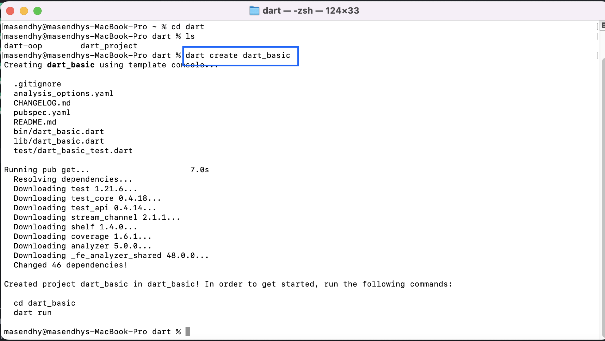
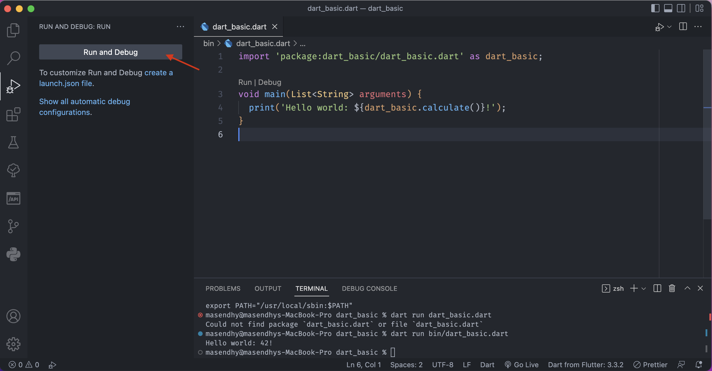
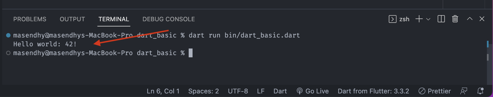

- Membuat project dart dapat dilakukan memalui terminal dengan menggunakan perintah

```zsh
dart create nama_project
```



- Membuat project dart dapat juga dilakukan melalui VS Code

> Buka VS Code -> View -> Command Palette -> -> Dart New Project -> Console Aplication -> Select folder for your project -> Create your name project

- secara otomatis akan dicompile-kan file project dart berupa aplikasi Hello world dan untuk menjalankan kode programnya dapat kita gunakan terminal dengan perintah

```zsh
dart run bin/dart_basic.dart
```

atau dengan menekan button Run and debug



maka hasilnya akan keluar print data pada terminal kita


