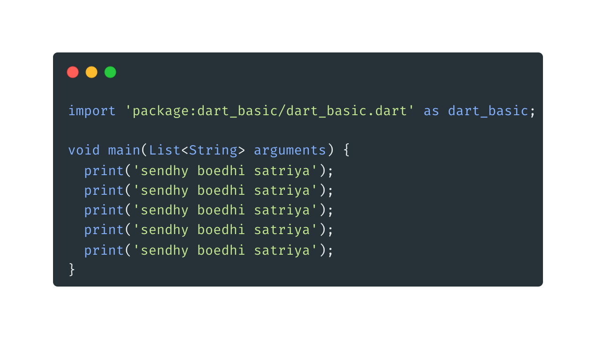
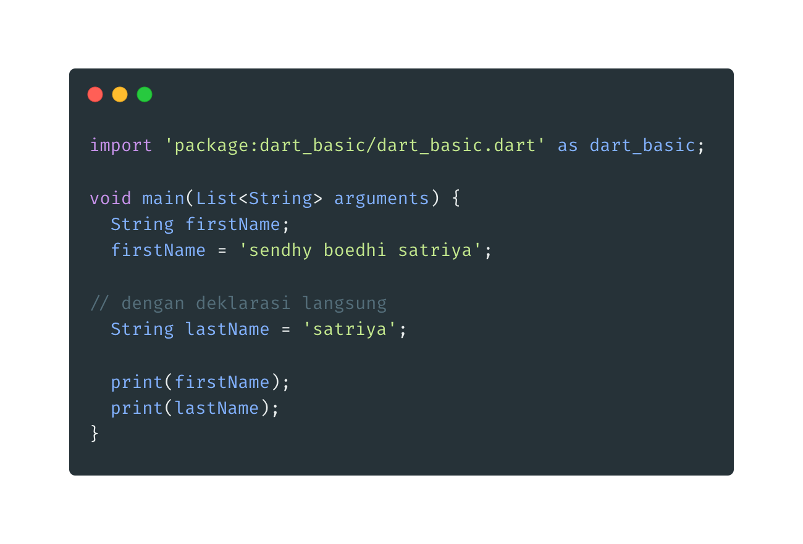
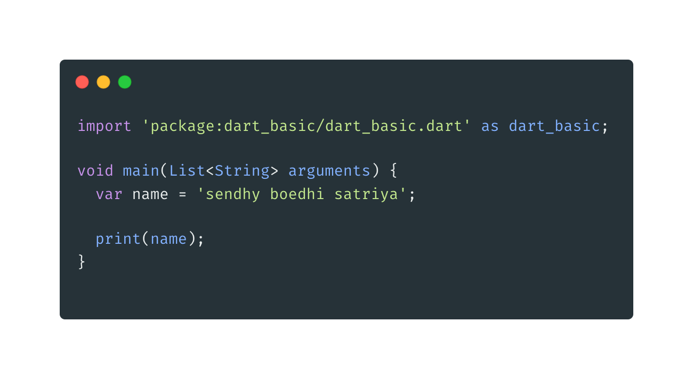
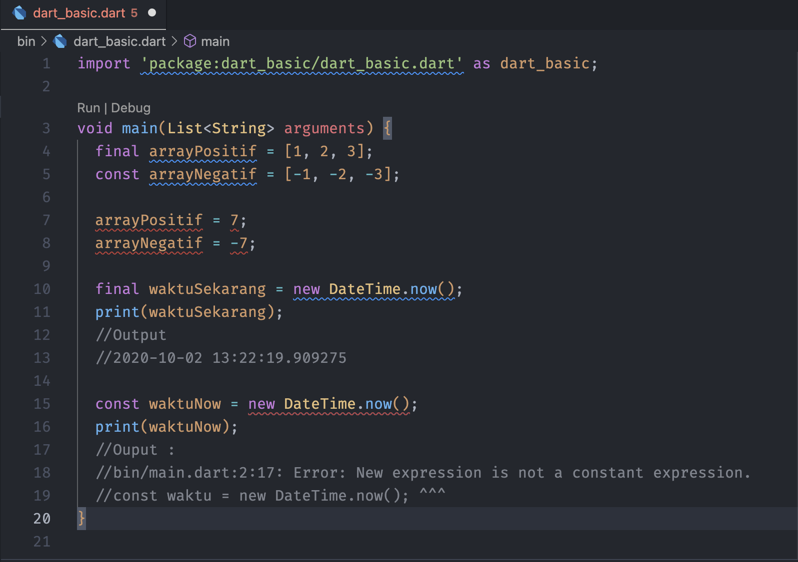
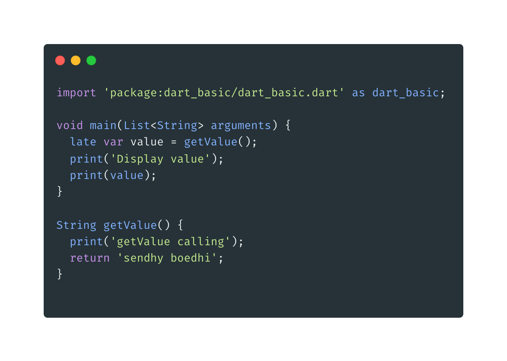

1.  Kata Kunci Var

        * Variable merupakan tempat untuk menyimpan data, ada banyak sekali tipe data di Dart, akan kita bahas di materi-materi tersendiri
        * Variable sangat berguna ketika kita ingin menggunakan data yang sama berkali-kali, dibandingkan kita buat berulang-ulang, lebih baik kita simpan data tersebut dalam variable
        * Variable wajib memiliki tipe data dan nama variable, ketika kita akan mengakses variable tersebut, kita cukup menyebutkan  nama variable nya

    - Kode program tanpa variable

    

    - Membuat tipe data var yaitu dengan cara
      > TipeData namaVariable;
      > String firstName;
      > firstName = 'sendhy'

    * dapat pula dengan cara _deklarasi langsung_ dan nama variabel dalam dart biasanya menggunakan camelCase.

      > String lastName = 'satriya '

      

    * Saat kita membuat variable langsung dengan nilainya, kita bisa menggunakan kata kunci var sebagai pengganti TipeData nya. TipeData akan dibaca sesuai dengan isi nilai nya secara otomatis oleh Dart, sehingga kita tidak perlu menyebutkannya lagi.

      

2.  Untuk membuat sebuah variable yang tidak dapat dideklarasikan ulang,dapat menggunakan kata kunci _final_ atau _const_

    

    ## _Kesimpulan_

    - **final** dan **const** merupakan keyword yang dapat digunakan untuk membuat variabel yang bersifat immutable.
    - Perbedaan utama ada pada inialisasi nilai (pemberian nilai) dari variabelnya, **const** _mengharuskan variabel harus dinialisasi pada saat kompilasi, nilai bersifat konstan dan secara langsung / eksplisit sehingga pada saat kompilasi variabel const sudah memiliki nilai_, sedangkan **final** tidak mengharuskan variabel memiliki nilai secara langsung / eskplisit pada saat kompilasi.

3.  Kata Kunci late, digunakan untuk mendeklarasikan sebuah variable pada saat sudah di akses saja, jadi jika belum di akses tidak perlu dideklarasikan.

    
