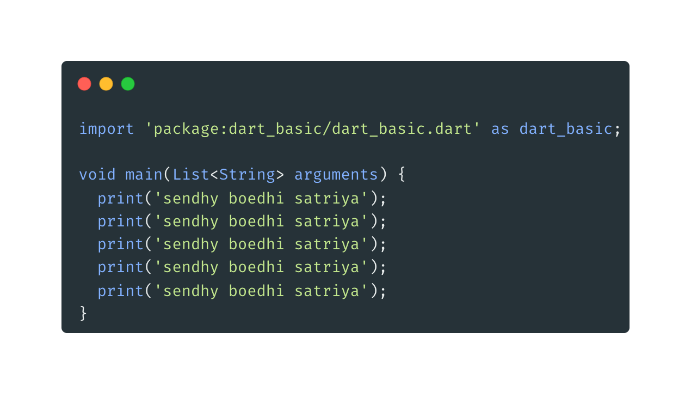
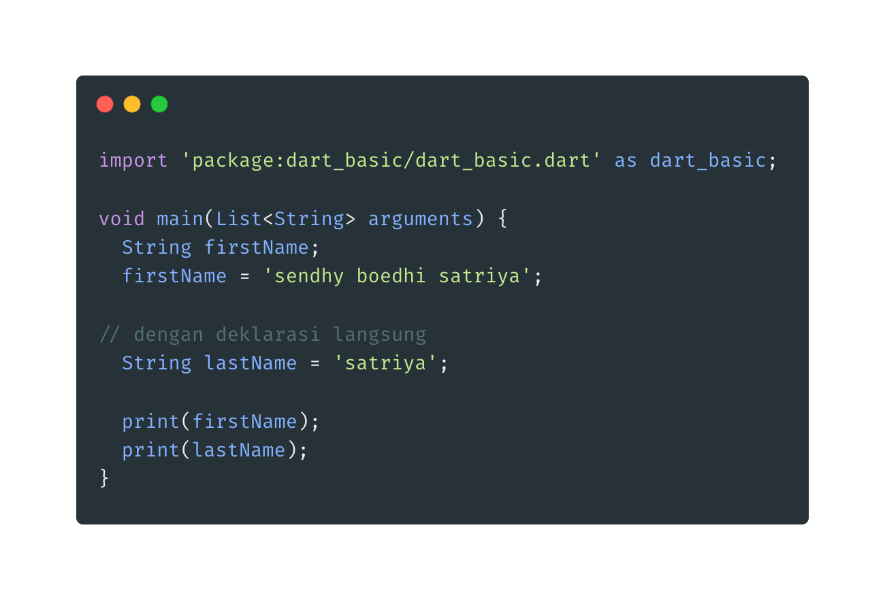

1.  Tipe Data Var

        * Variable merupakan tempat untuk menyimpan data, ada banyak sekali tipe data di Dart, akan kita bahas di materi-materi tersendiri
        * Variable sangat berguna ketika kita ingin menggunakan data yang sama berkali-kali, dibandingkan kita buat berulang-ulang, lebih baik kita simpan data tersebut dalam variable
        * Variable wajib memiliki tipe data dan nama variable, ketika kita akan mengakses variable tersebut, kita cukup menyebutkan  nama variable nya

    - Kode program tanpa variable

    

    - Membuat tipe data var yaitu dengan cara
      > TipeData namaVariable;
      > String firstName;
      > firstName = 'sendhy'

    * dapat pula dengan cara _deklarasi langsung_ dan nama variabel dalam dart biasanya menggunakan camelCase.

      > String lastName = 'satriya '

      

    * Saat kita membuat variable langsung dengan nilainya, kita bisa menggunakan kata kunci var sebagai pengganti TipeData nya. TipeData akan dibaca sesuai dengan isi nilai nya secara otomatis oleh Dart, sehingga kita tidak perlu menyebutkannya lagi.

      
