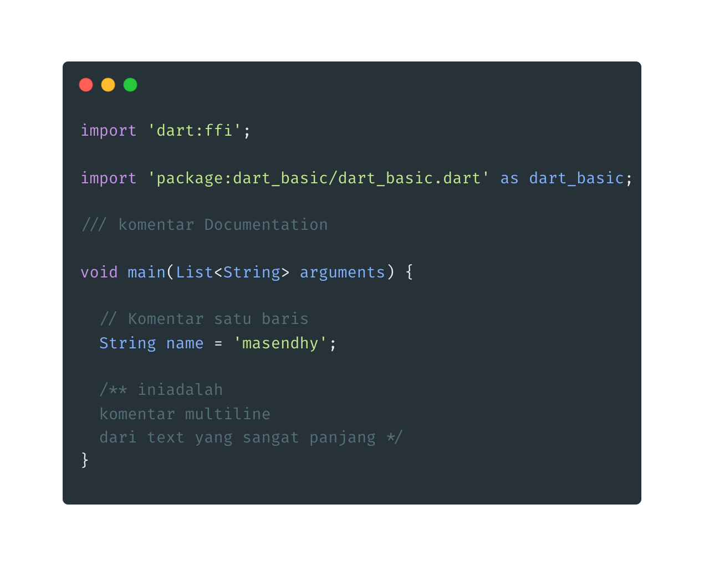

**Komentar** adalah kode program yang akan diabaikan ketika kode program di compile.

- **Jenis Komentar**

  - Documentation : ///
  - Singgle line : // isi Komentar
  - Multi line : /\* isi komentar /

  
