- **Tipe Data Number**
  - Number adalah tipe data angka, terdapat dua jenis tipe data Number, int dan double
  - int adalah tipe data bilangan bulat
  - double adalah tipe data bilangan desimal
  - Penulisan koma dalam double menggunakan titik, bukan koma
  * jika ingin meggunakan tipe data number yang bisa int ataupun double, kita bisa menggunakan tipe data num

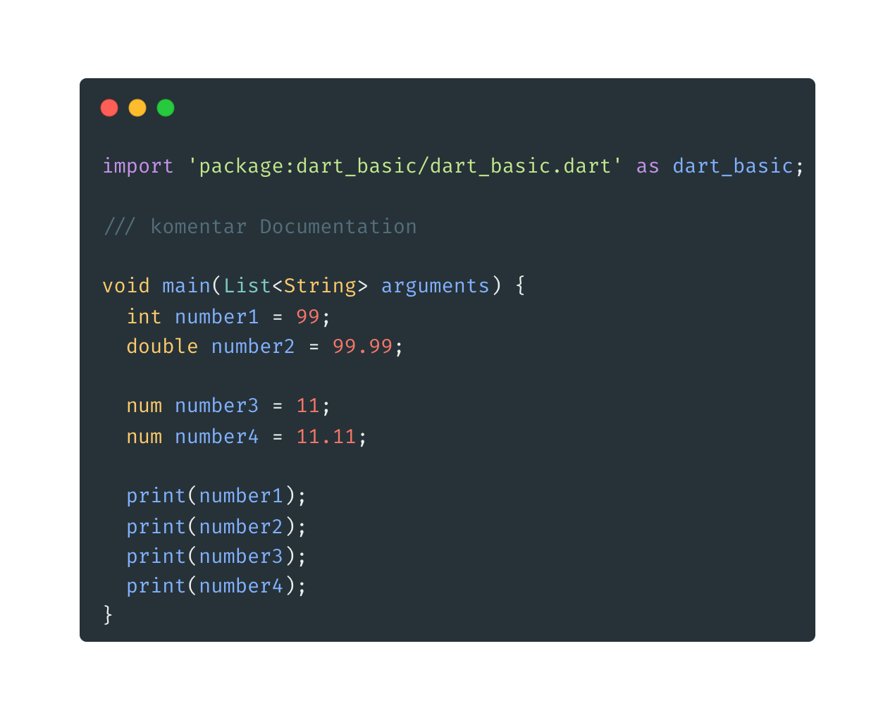

- **Tipe Data Boolean**

  - Boolean adalah tipe data yang hanya memiliki dua nilai, yaitu benar atau salah
  - Boolean direpresentasikan dengan kata kunci bool
  - Untuk nilai benar, menggunakan kata kunci true
  - Untuk nilai salah, menggunakan kata kunci false

  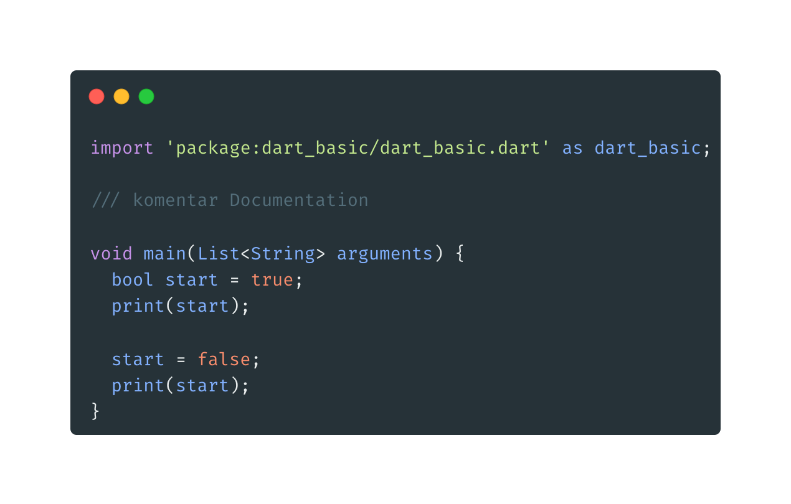

* **Tipe Data String**

  - String merupakan tipe data text atau tulisan
  - Untuk mebuatnya menggunakantanda baca kutip ' ' ataupun " "

  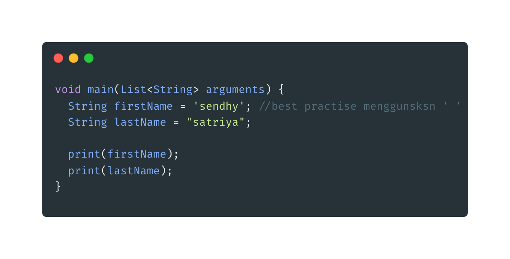

  **String Expression**

  - Yaitu mengambil data dari string lain
  - Untuk menggunakannya yaitu dengan format ${isiExpression}

  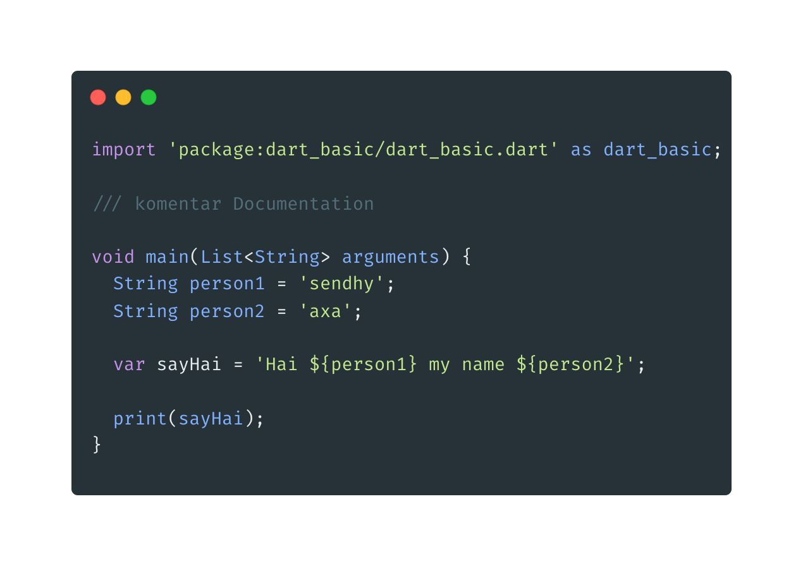

  **Backslash**

  - digunakan untuk menuliskan suatu karakter spesial atau simbol

  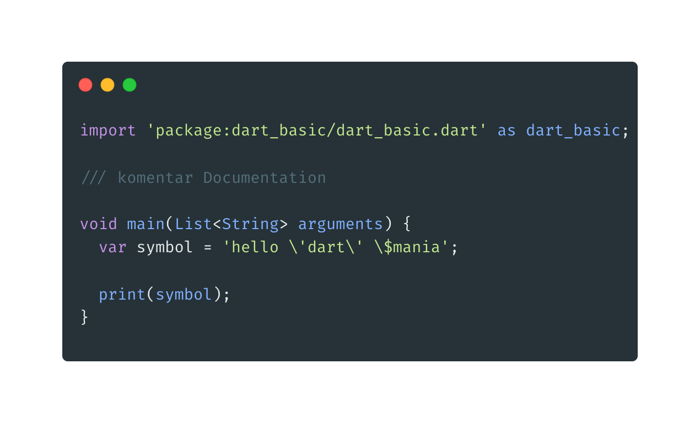

  **Menggabungkan String**

  - Untuk menggabungkan string dapat dilakukan dengan menggunakan tanda + atau dengan karakter spasi/enter/tab

  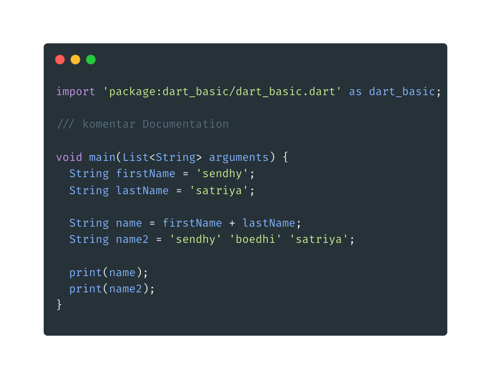

  **String Multiline**

  - Digunakan untuk membuat string yang sangat panjang dan tidak memungkinkan dibuat dalam satu baris

  * Caranya dengan menggunakan ''' stringnya '''

  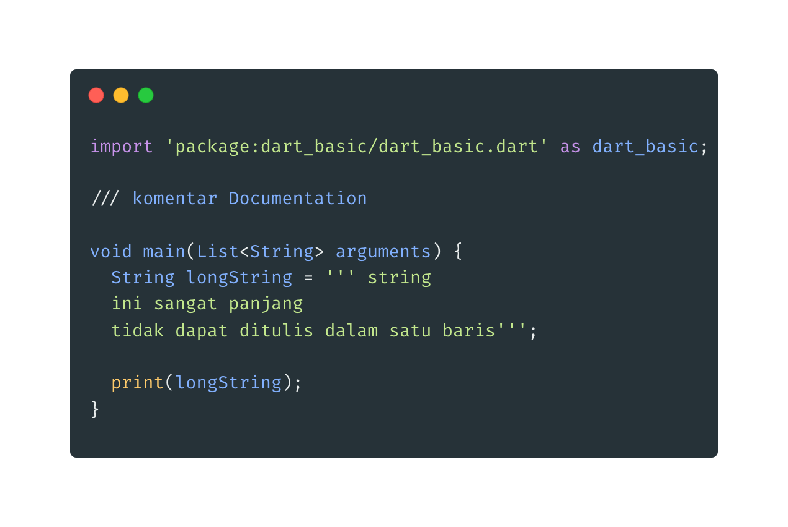

* **Tipe Data Dynamic**

  - Digunakan unutk membuat variabel yang dapat menampung semua jenis tipe data.

  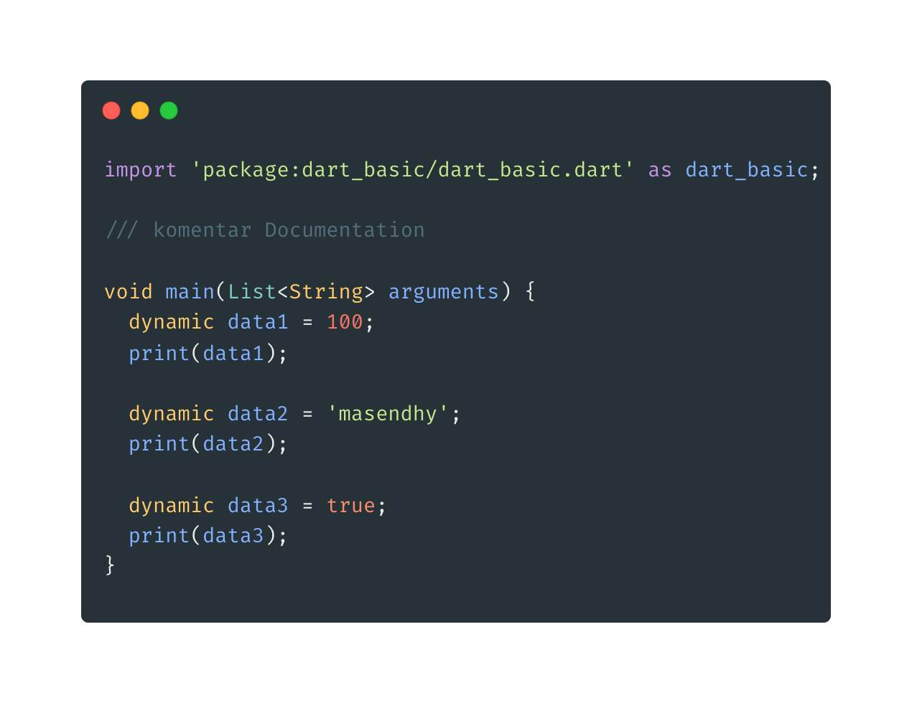

* **Konversi Tipe Data**

  - Dilakukan saat ingin merubah tipe data ( biasanya dari inpu data), menjadi tipe data yang kita inginkan

  - untuk merubah int/double/bool menjadi String menggunakan .toString()

  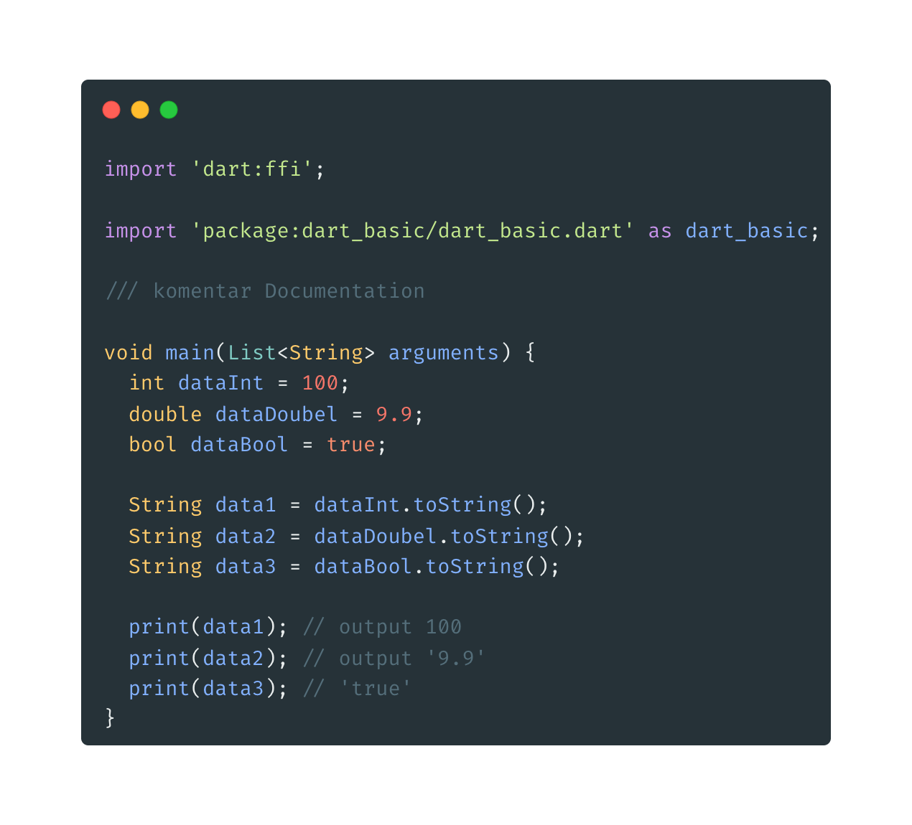

  - untuk merubah data string menjadi int menggunakan int.parse(inputStringnya) sedangkan untuk menjadi double menggunakan double.parse(inputSringnya)

  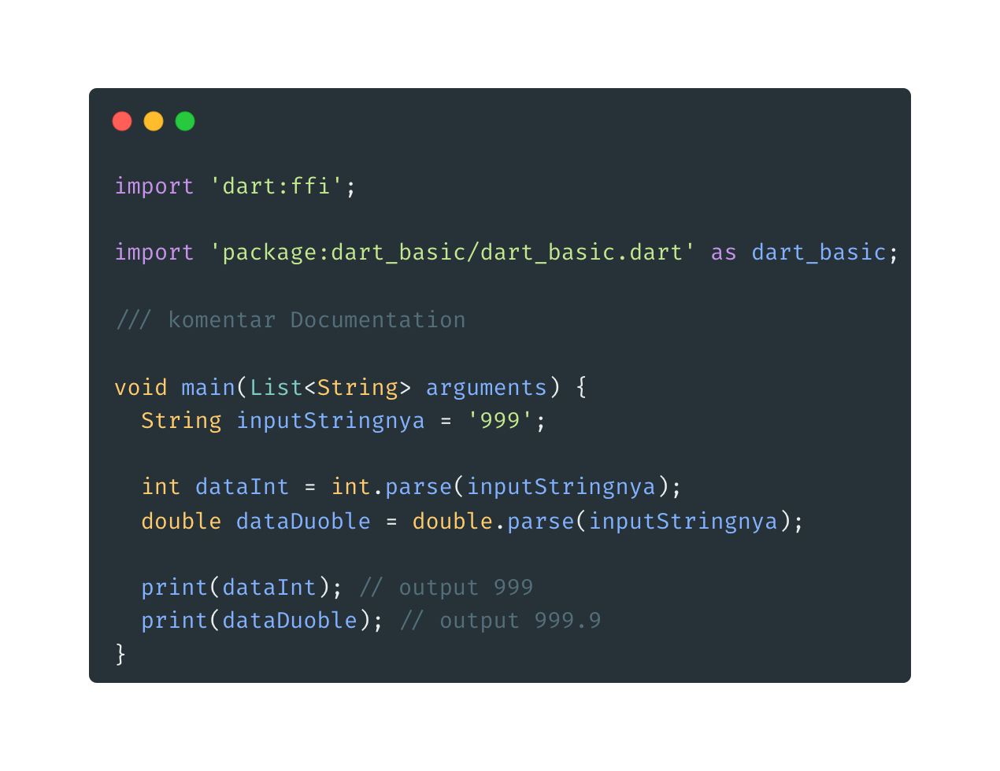

  - untuk merubah data int menjadi double menggunakan inputInt.toDouble() sedangkan double menjadi int inputDouble.toInt()

  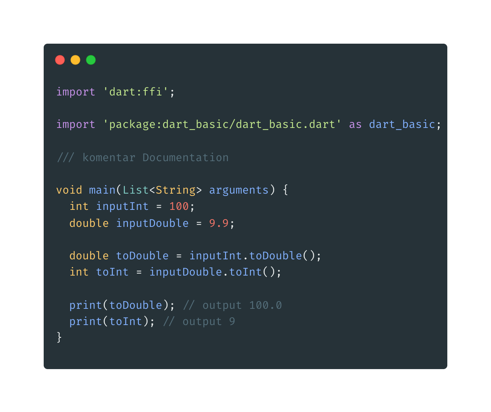
