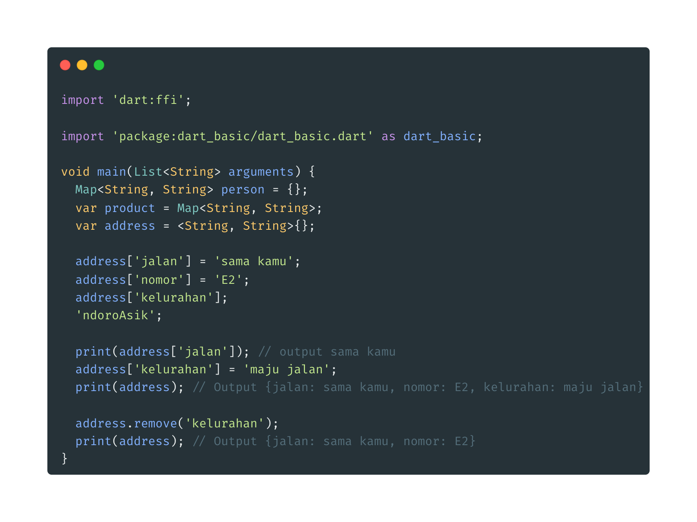

- **Map**

- Map mirip dengan list, pada list memerlukan index sedang map memerlukan key

* Untuk membuat Map menggunakan perintah :

> Map<TipeKey,TipeValue> namaVariable = { };
> var namaVariabel = Map<TipeKey,TipeValue>{ };
> var namaVariabel = <TipeKey,TipeValue> { };

- Manipulasi Map
  
