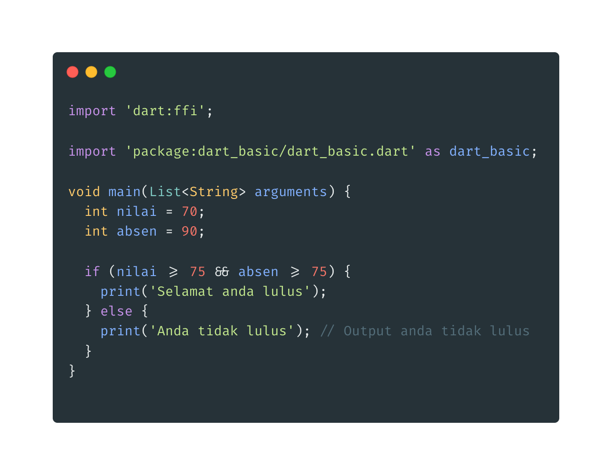

- **If**
- adalah kata kunci untuk suatu percabangan, blok if akan dieksekusi ketika kondisi if bernilai true
  

* **Else**
* blok else akan di eksekusi jika blok if bernilai false
  

* **Else if**
* blok else if digunakan saat membutuhkan beberapa kondisi sekaligus
  
