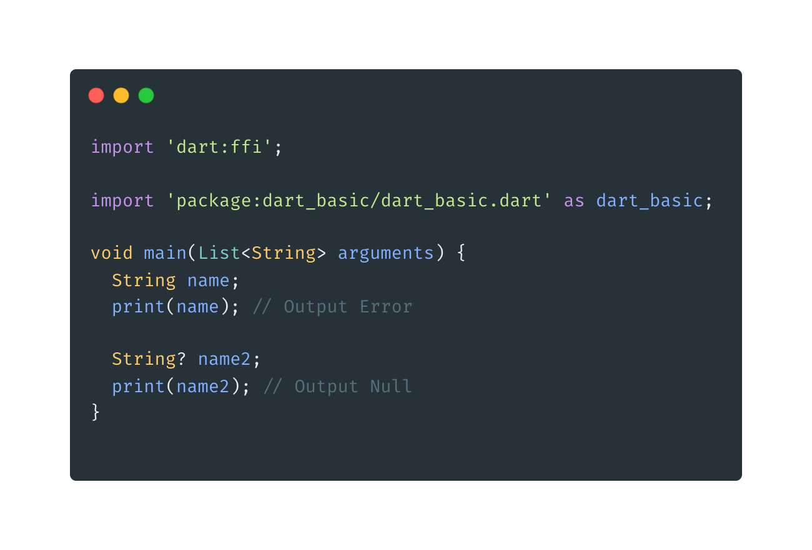
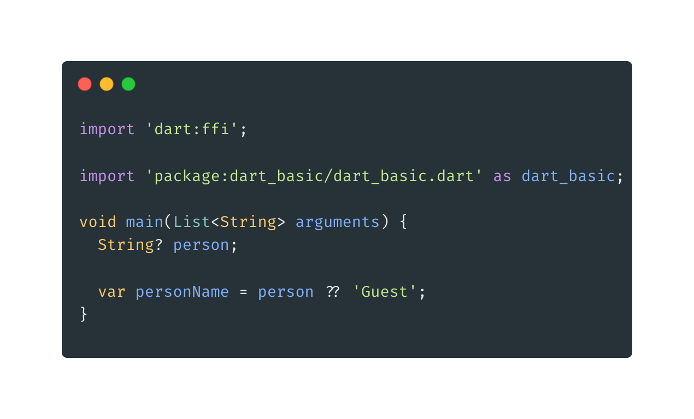
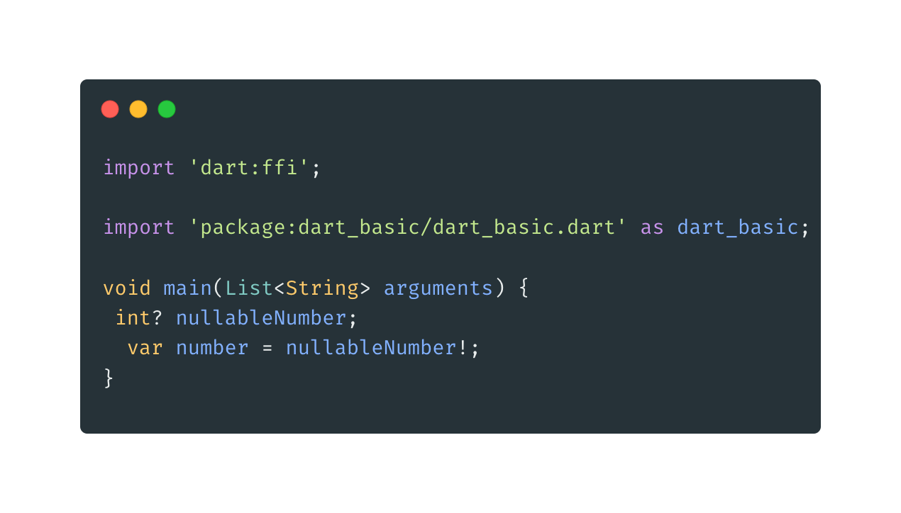

- **Null**
- Null adalah representasi data kosong, secara default saat kita membuat variabel maka harus memiliki nilai, jika tidak maka variabel tidak bisa digunakan. Tetati jika kit ingin membuat variabel bernilai null, kita bisa menambahkan tanda tanya (?) pada tipeDatanya.
  

  **Null Default Value**

* Memberikan value default pada variabel null dengan menggunakan operator ?? (tanda tanya dua kali)
  

  **Koversi secara paksa**

  - Dalam Dart kita bisa mengubah dati tipe data nullable menjadi non nullable dengan menggunakan operator ! (tanda seru)
    
