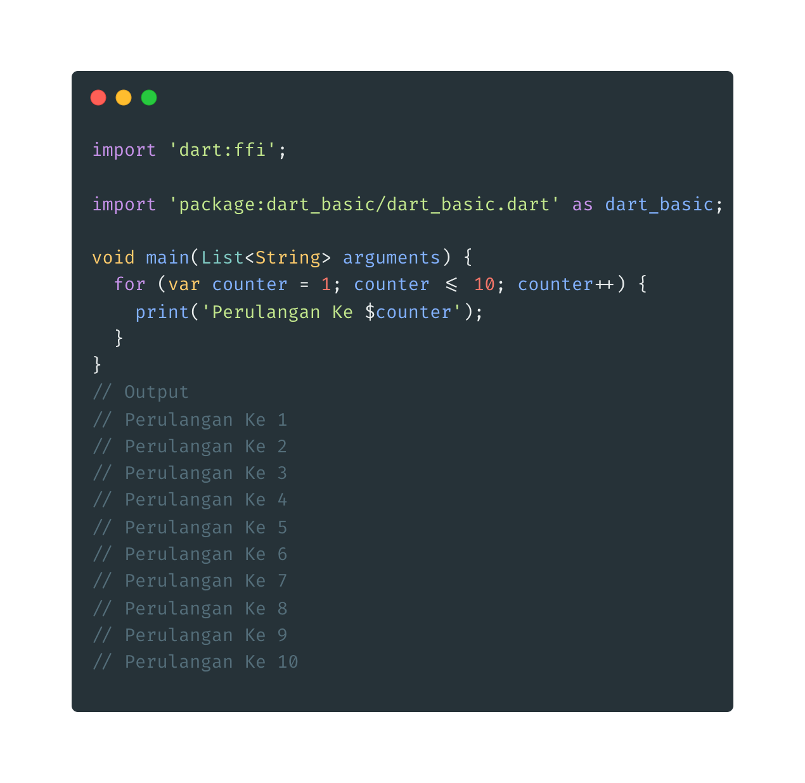
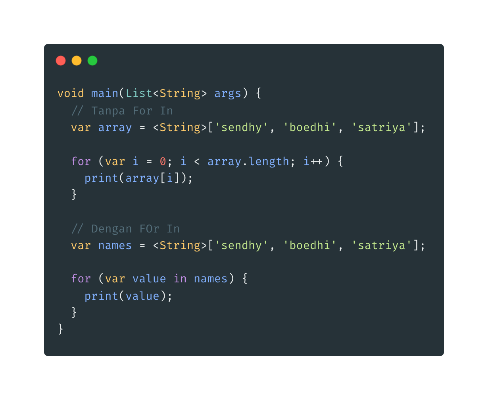

- **For**

* For digunakan untuk melakukan perulangan
* Sintak perulangan for

  > for (init statement ; kondisi ; post statement){
  > //blok perulangan
  > }

  

* **For In**
* Digunakan untuk mengakses seluruh data list secara otomatis
  
