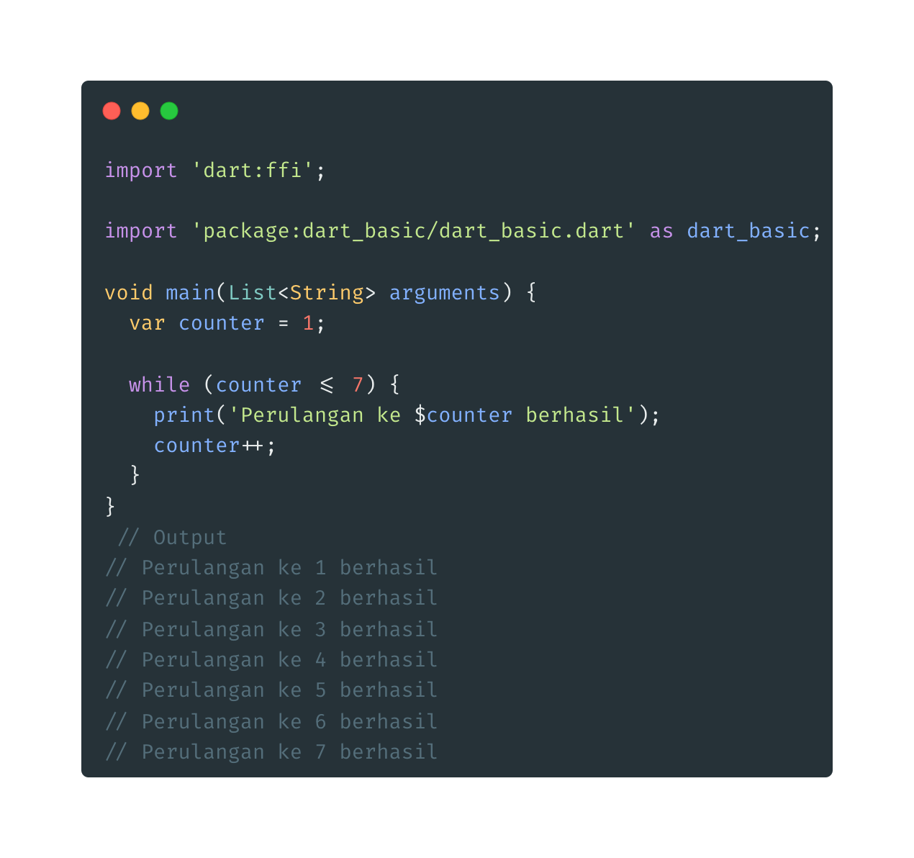
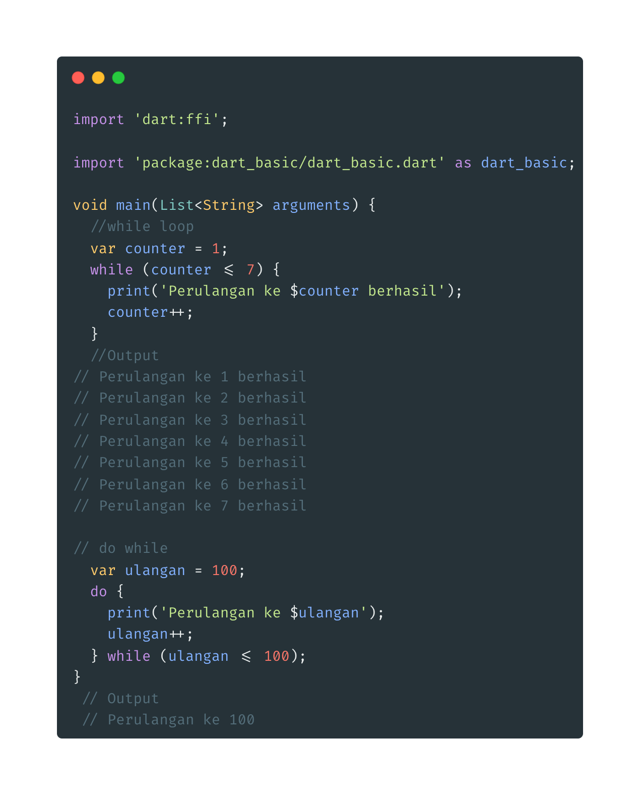

- **While loop**
- Bentuk perulangan tanpa menggunakan init dan post statement

- _Do While loop_, adalah perulangan yang mirip dengan while, perbedaannya adalah pegecekan kondisi pad do while loop dilakukan setelah perulangan dilakukan
  
