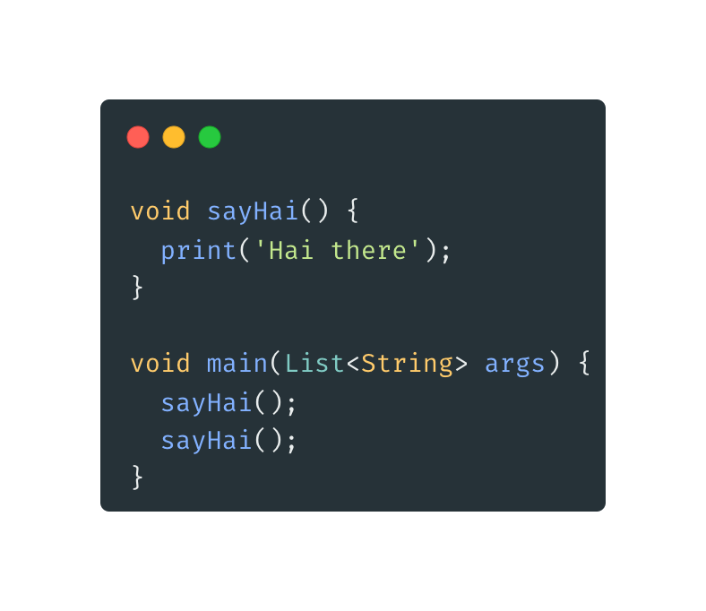
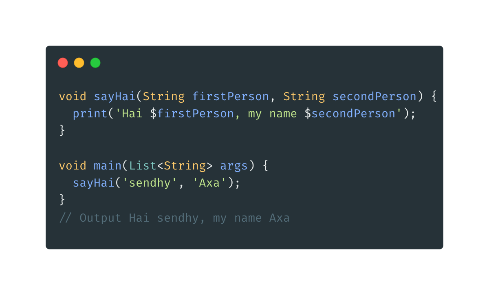
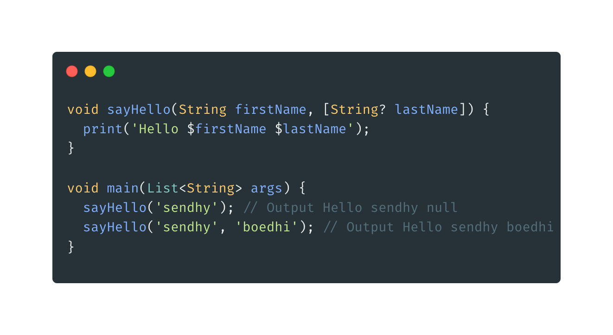
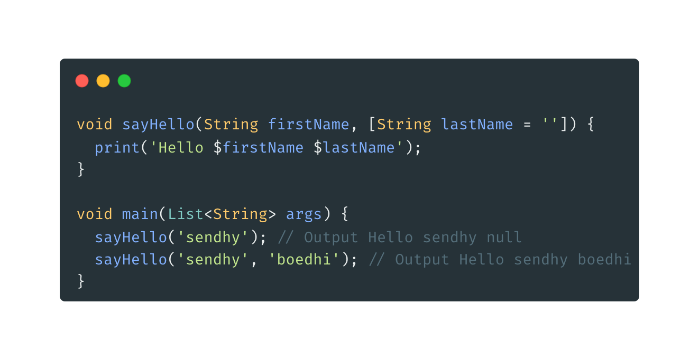
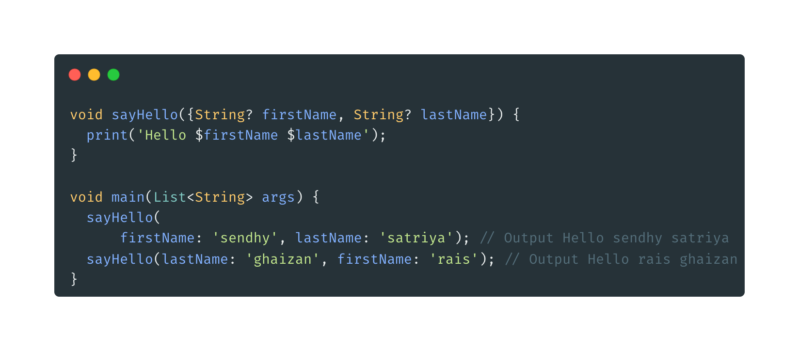
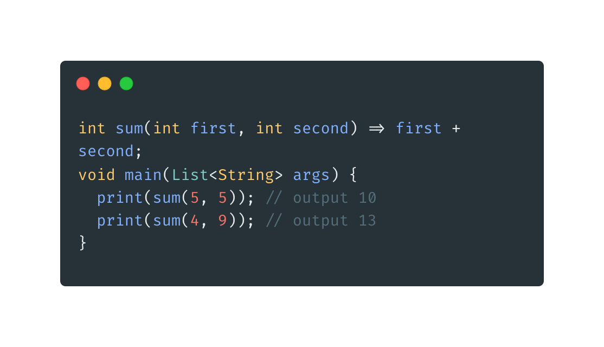

- **Function**
- Untuk membuat funtion dalam Dart menggunakan kata kunci void kemudian diikuti namafunctionnya, lalu tanda kurung dan di akhiri dengan blok
  

  **Function Parameter**

  - Parameter dalam function ditulis didalam kurung (), dipisahkan dengan tanda , (koma), jika parameternya lebih dari satu.
    

**Optional Parameter**

- Secara default prameter wajib dikirim saat memanggil function, pada Dart kita bisa memberikan optional parameter dengan cara memberikan tanda [].

* Optional Parameter harus nullable
  

* Optional Parameter Default value
  

* Named Parameter, memanggil parameter sesuai dengan nama parameternya, menambahkan tanda {} pada saat membuat parameter.
  

* Function Expression, function 1 baris dan tidak membutuhkan return.
  
