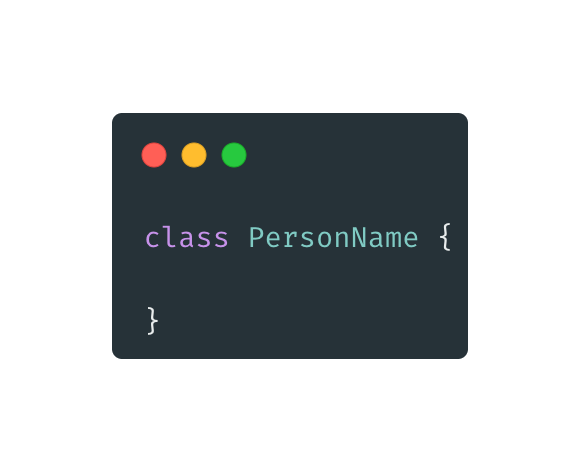
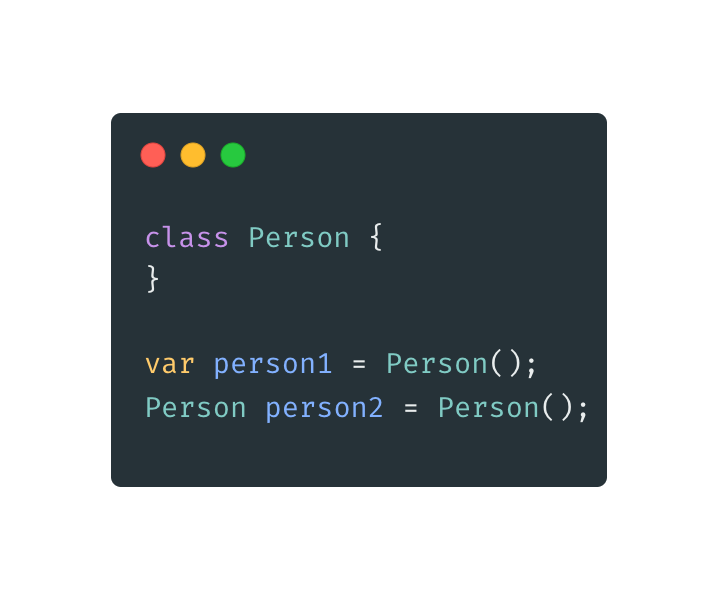
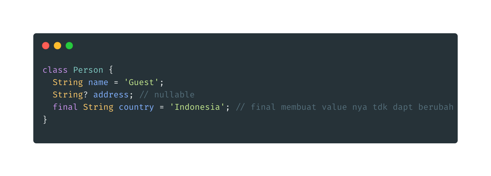
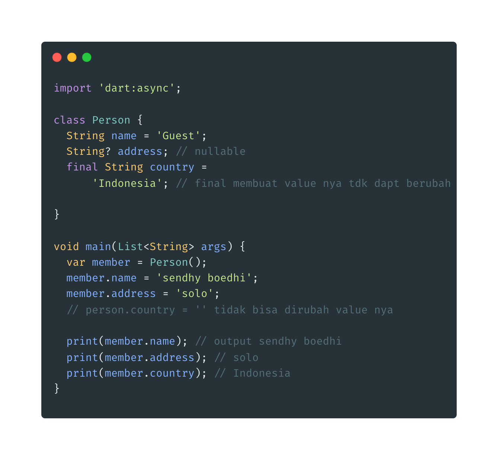

- **Membuat Class**

* dibuat dengan kata kunci class, dan penamaannya menggunakan PascalCase.
  

* **Membuat Object**
* Untuk membuat object kita bisa menggunakan nama class lalu diikuti dengan kurung ()
  

* **Membuat Field**
* Field adalah data yang kita sisipkan kedalam object, dalam bahasa pemrograman yang lain biasa disebut juga properties / attributes
* field dibuat seperti halnya membuat variebel, hanya saja di tempatkan didalam blok class.
  

* Memanipulasi field
  
