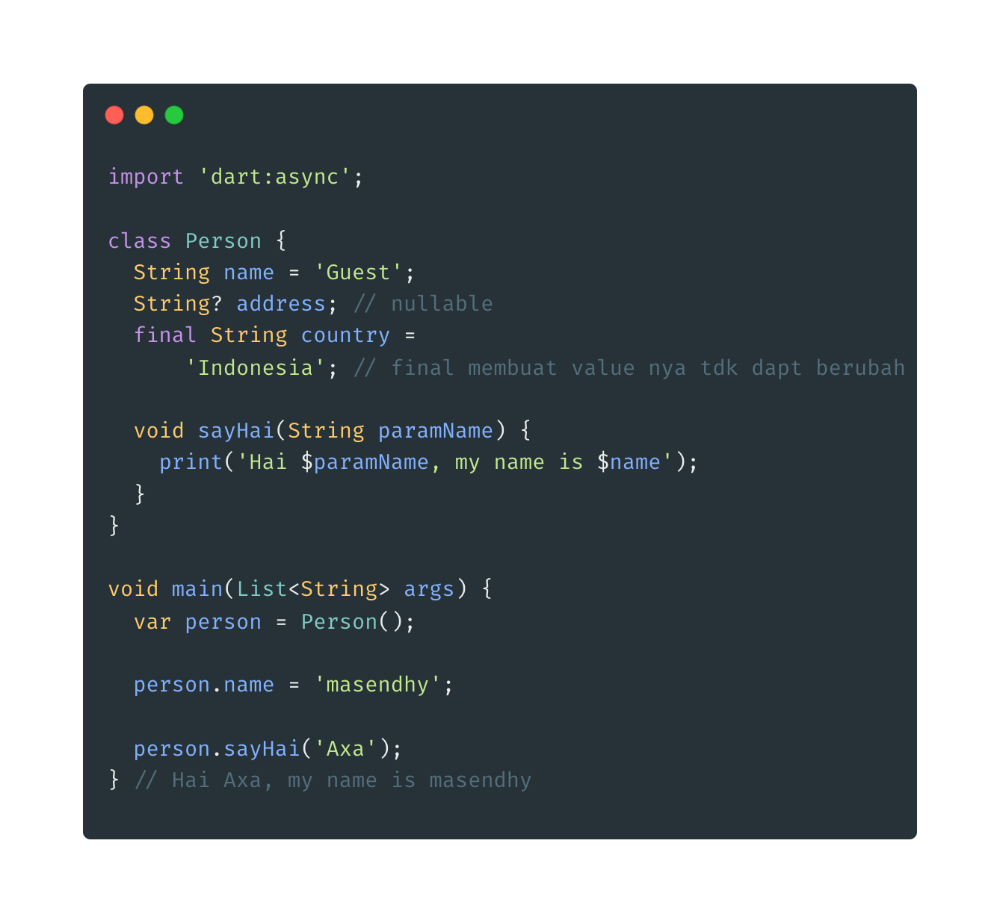
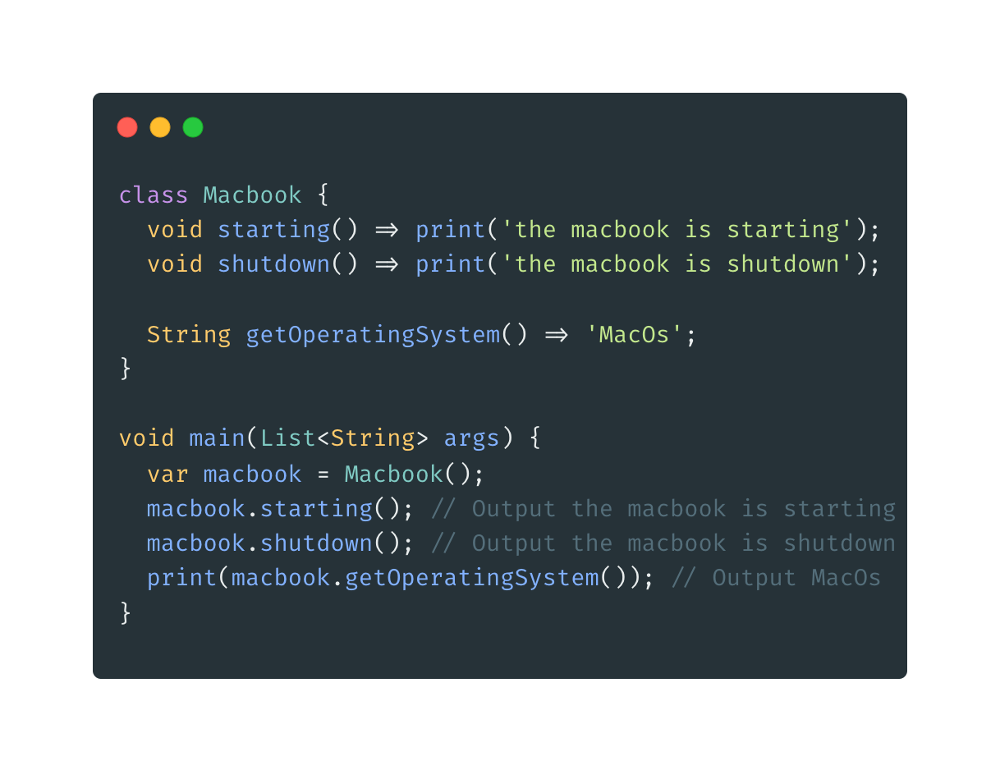
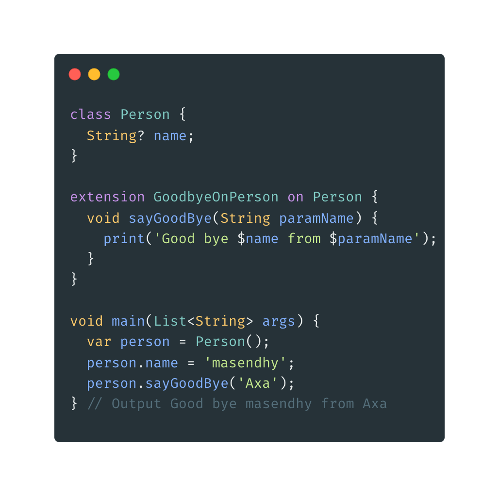

- **Method**
- biasa juga disebut dengan function, method dibuat didalam block class dan dapat di akses dengan cara yang sama dengan field.
  

* **Method Expressin Body**
* digunakan untuk membuat method yang hanya erdiri dari 1 baris saja.
  

* **Extension Method**
* adalah cara menambahkan method terhadap class yang sudh ada tanpa harus merubah class tersebut. Hal ini biasanya class merupakan milik library yang berbeda.
* dibuat dengan menambahkan kata kunci extension lalu nama extensionnya kemudian kata kunci on dan nama class yang akan ditambahkan.
  
