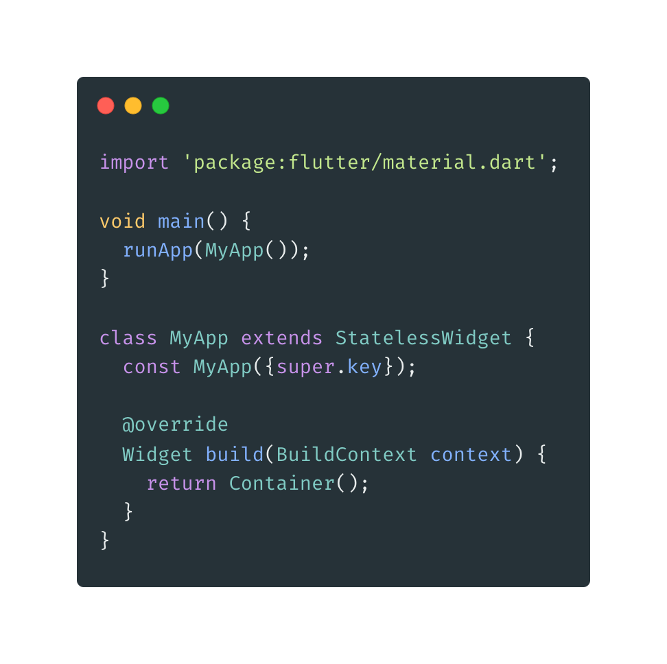
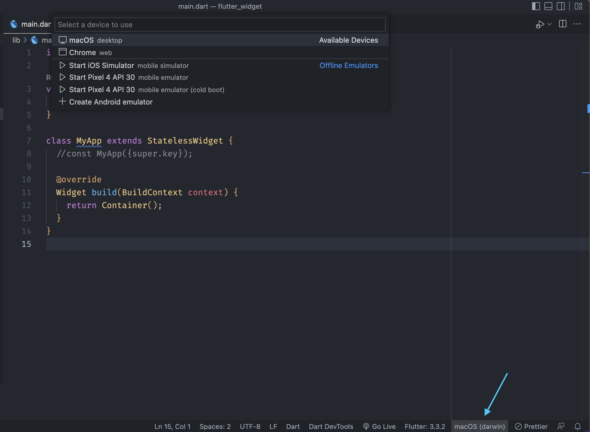

- **Membuat Project dengan Flutter**

* Menggunakan terminal :

1. buka terminal dan sesuaikan folder tempat temen-temen ingin membuat project nya, gunakan perintah :

```zsh
flutter create nama_projectnya
```

2. Atau temen-temen bisa juga membuatnya lewat VS Code

> Buka VS Code -> View -> Command Palette -> -> Flutter New Project -> Aplication -> Select folder for your project -> Create your name project

3. Untuk membuat nya dari awal, temen-temen dapat membuka file main.dart dalam lib.

> lib -> main.dart

4. Kemudian karena ingin membuatnya dari awal, maka silahkan hapus semua code mulai dari _class MyApp_ sampai dengan coding paling bawah.

5. Kemudian silahkan temen-temen ketik

   > stl untuk membuat stateless widget
   > atau
   > stf untuk membuat stateful widget

   _stateless dan stateful widget_ akan kita bahas pada chapter selanjutnya.

6. Rubah nama class MyWidget menjadi MyApp
   

7. Untuk mengaktifkan emulator milik temen-temen, ikuti petunjuk berikut
   
