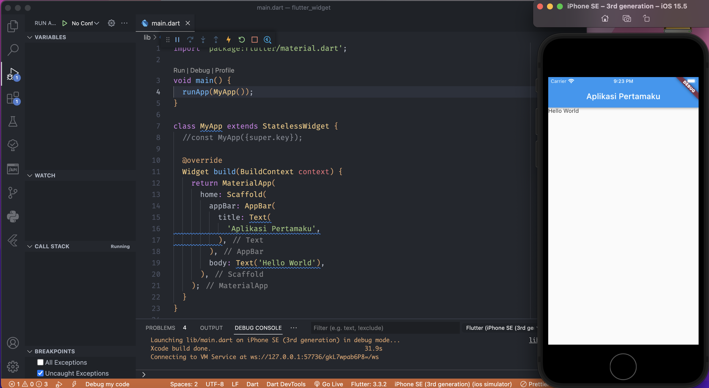

- **Aplikasi Pertamaku**

1. Untuk memulainya dari awal, silahkan temen-temen lakukan tutorial pada chapter _Membuat project dengan Flutter_
2. Kemudian kali ini kita akan menggunakan MaterialApp untuk menampilkan aplikasi kita, dan kita menggunakan property _home_ dan kita pasang widget _Scaffold_
3. Widget _Scaffold_ memiliki banyak property yang bisa kita gunakan, kali ini kita akan memakai property _appBar_, untuk property _appBar_ itu sendiri, kita akan memasang widget _appBar_ untuk menampilkan judul aplikasi kita.
4. Kemudian untuk menampilkan isi aplikasi, kita menggunakan property _home_ dengan widget _Text_
5. Untuk menjalankannya tekan _F5_

