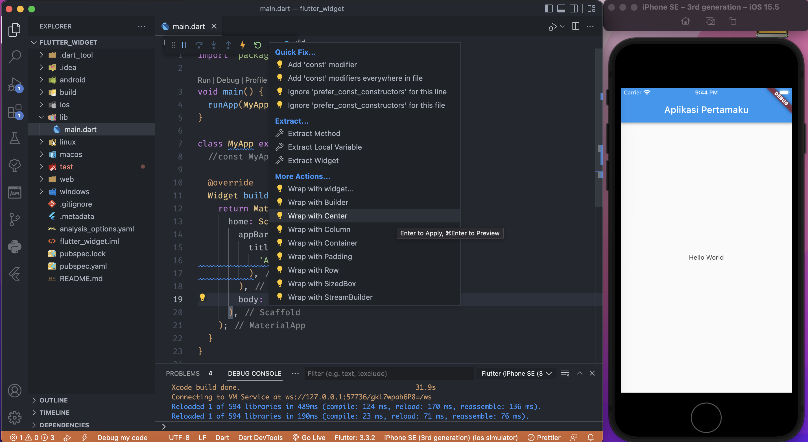
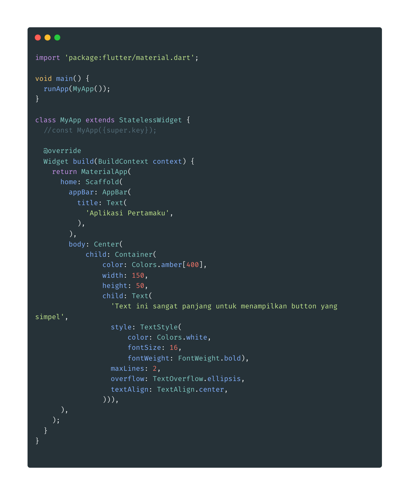
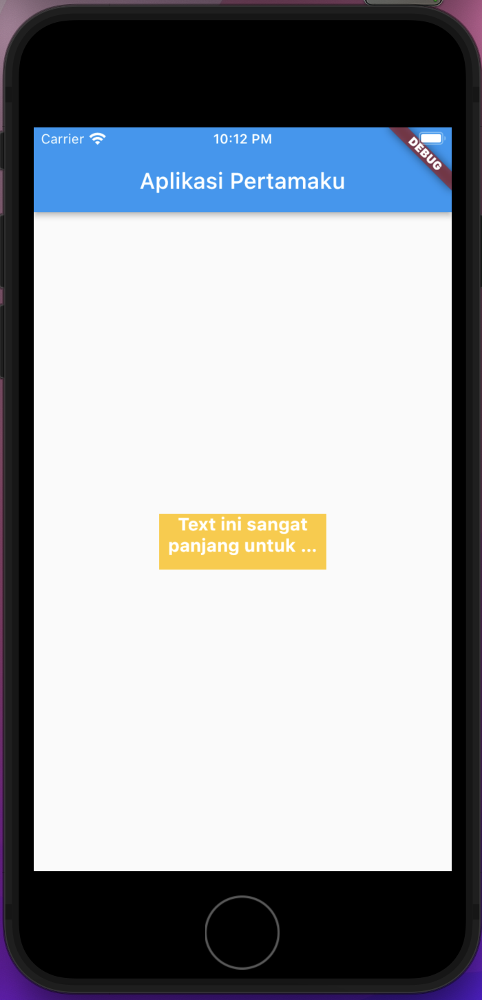

- **Widget Text**

1. Kita lanjutkan tutorial sebelumnya, kali ini kita akan membungkus widget _Text_ yang ada dalam property _body_ dengan widget _Center_
2. Untuk membungkusnya, kita bisa menggunakan shortcut

   > command . -> Wrap with Center

   

3. Memberikan background color pada widget _Text_ di body

> bungkus kembali widget _Text_ dengan _Container_,

kemudian temen-temen dapat tambahkan property color,width dan height,maxlines,overflow, textAlign untuk memberikan style pada text nya

