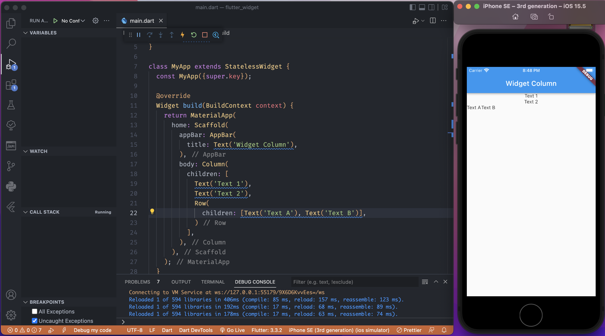
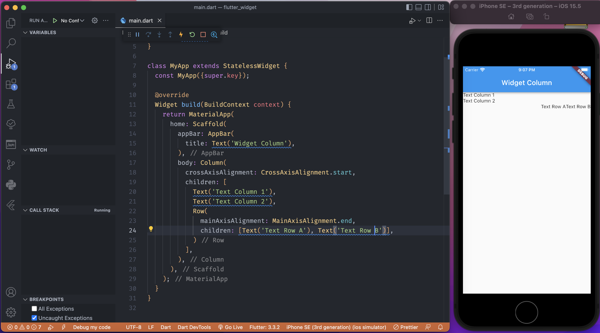

- **Column Widget**
- akan membungkus widget lain dan tersusun kebawah.

* **Row Widget**
* akan membungkus wdget lain dan tersusun menyamping.

- **crossAxisAligment** pada _column_ akan mengatur aligment secara horisontal ( start = kiri dan end = kanan)

* **mainAxisAligment** pada _column_ akan mengatur aligent secara vertikal (start = atas dan end = bawah )

* **mainAxisALigment** pada _row_ akan mengatur aligment secara horisontal ( start = kiri dan end = kanan), sedangkan **crossAxisAligment** pada _row_ tidak ada.

