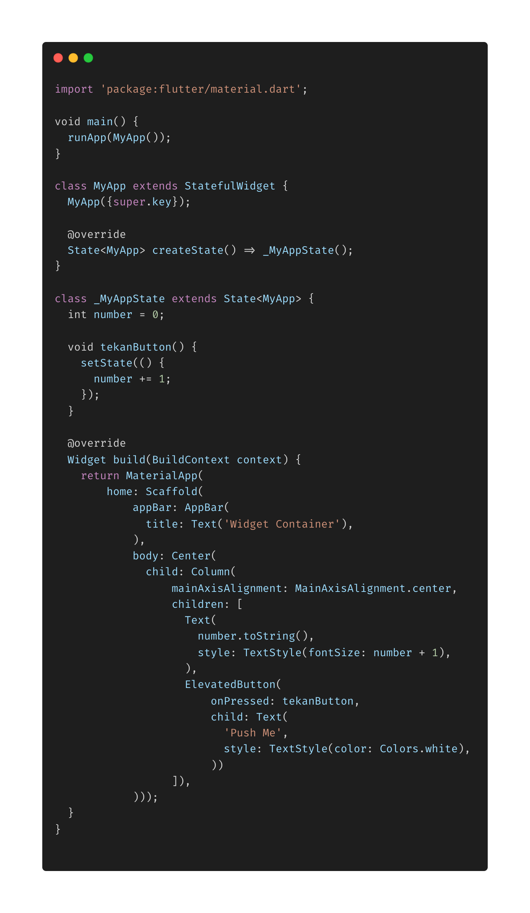
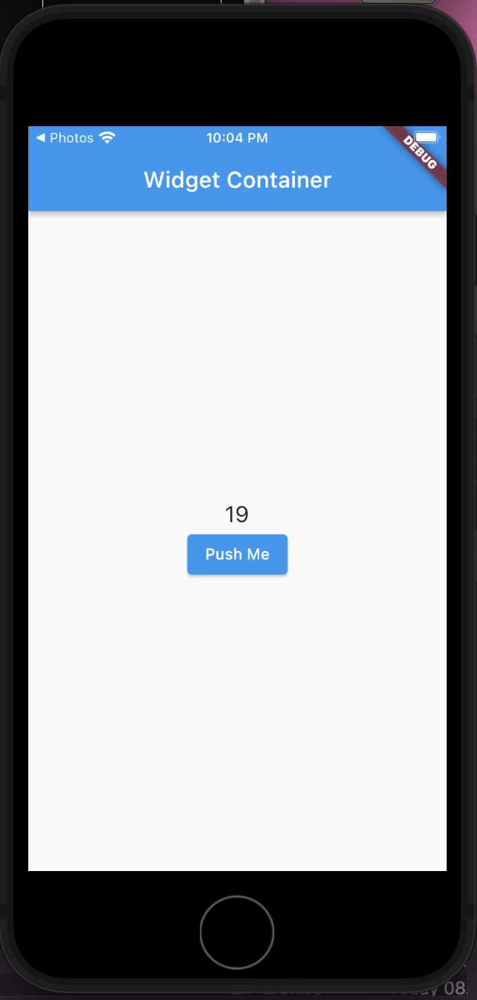

- **Stateful dan Stateless Widget**

* **Stateless** digunakan untuk membuat widget yang tidak berubah datanya, sedangkan **Stateful** digunakan untuk membuat widget yang datanya dapat berubah, misal button.
  
  
