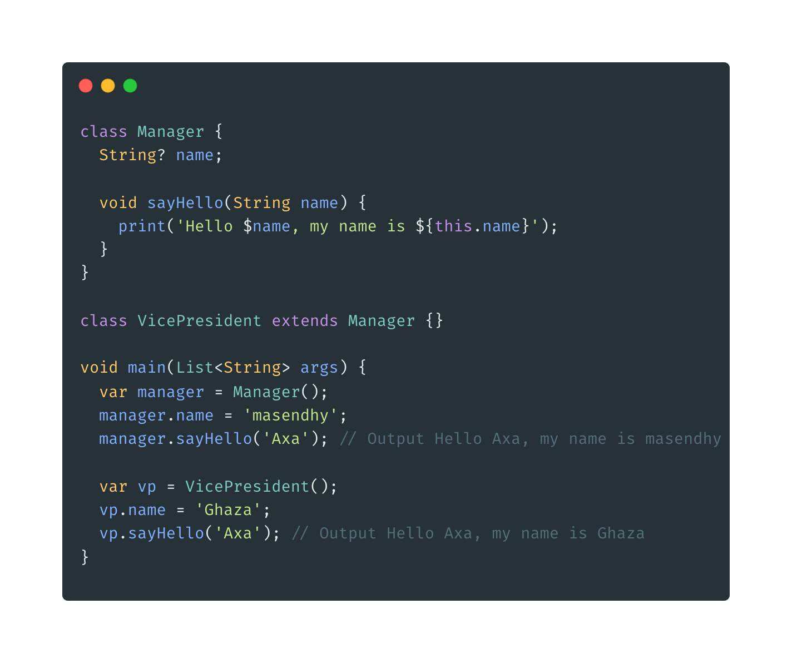

- **Inheritance**
- Biasa disebut juga pewarisan, yaitu kemampuan menurunkan class ke class yang lain. Artinya kita dapat membuat class Parent dan class Child.
- class Parent dapat memiliki banyak class Child, sedang class Child hanya dapat memiliki 1 class Parent.
- Untuk melakukan pewarisan, di class child harus menggunakan kata kunci extends kemudian diikuti nama class parentnya.
  
