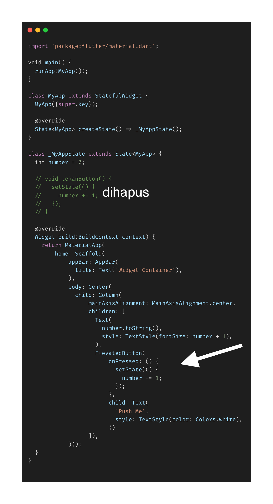

- **Anonymous Method** digunakan untuk menjalankan method yang dipakai pada satu tempat saja.
  contoh method yang memiliki nama
  > void pushMe(){
  > number += 1;
  > };

contoh anonymous method

> (){
> number += 1;
> }

