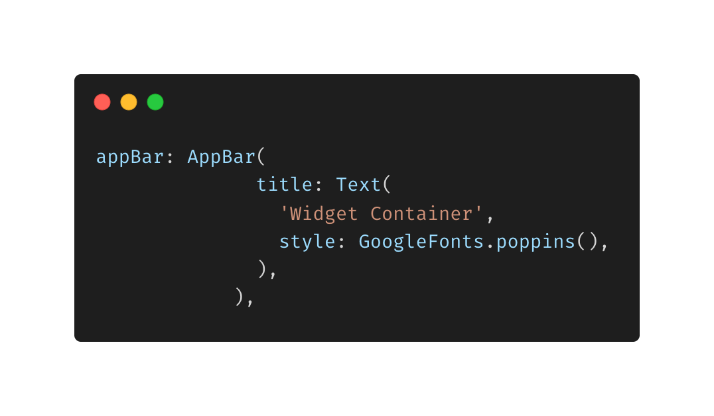
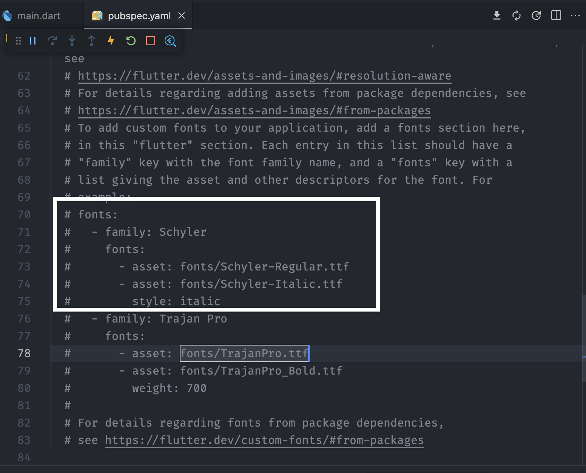

- **Font Style**
- Untuk menambahkan google font di pubspec.yaml dapat dilakukan dengan cara ( jika sdh install extension :Pubspec Assist)
  > command shift p
  > ketikan pubspec assist : Add / Update dependencies enter
  > lalu ketikan google font
  > maka akan ditambahkan secara otomatis google_font dependencies

* jika belum install extensionnya, bisa kunjungi _pub.dev_ lalu ketikkan google font, pilih installing -> copy dependencies nya -> pastekan pada dependencies di pubspec.yaml

* Untuk menggunakannya :

- Cara ketiga untuk menambahkan font yaitu

  > donwload font yang diinginkan, buat folde font tersendiri pada project
  > copy kan font yang telah di download tadi
  > daftarkan nama font nya di pubspec.yaml -> font

  
