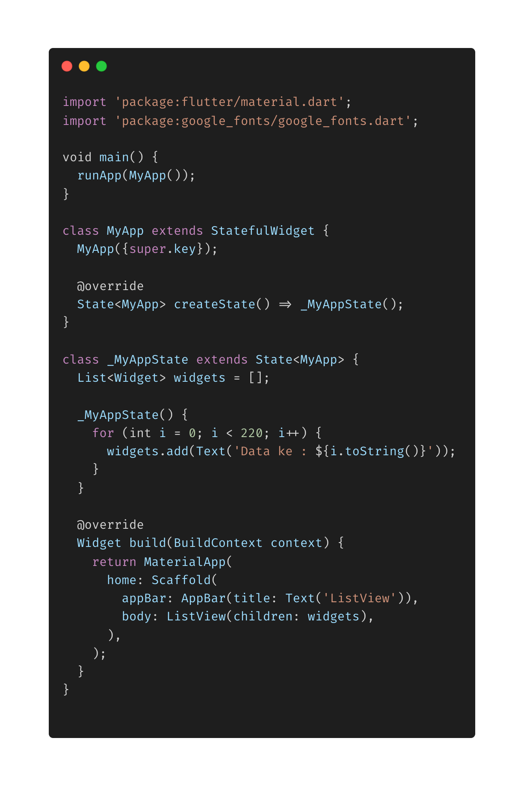

- **List View** digunakan untuk menggantikan Column jika data yang akan ditampilkan melebihi ukuran dari layar , dengan ListView, layar dapat di scroll dan data dapat ditamplikan semua.

* Menampilkan data dengan Column
  
  

* Menampilkan data dengan ListView
  
  

* Membuat aplikasi Tambah dan Hapus Data dengan ListView
  
  
