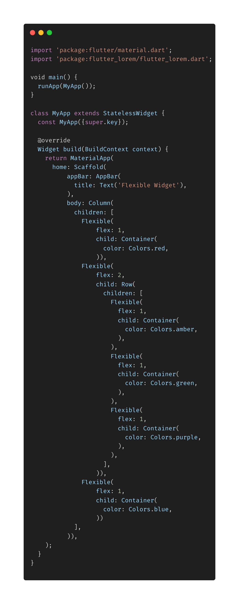
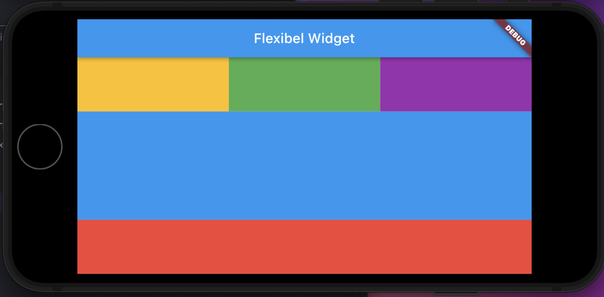
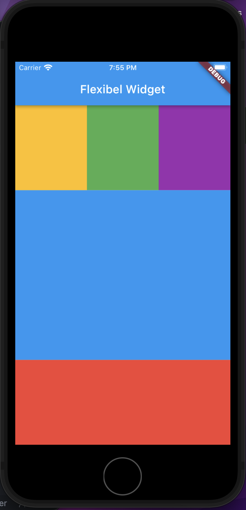

- **Flexible Widget** kali ini kita akan belajar menggunakan widget Flexible yang kita gunakan untuk membungkus setiap container dengan property _flex_ yang kita pakai untuk mengatur luas setiap containernya.
- Dengan widget Flexibel dan properti flex ini kita dapat melihat bahwa tampilan aplikasi kita benar benar responsive.

