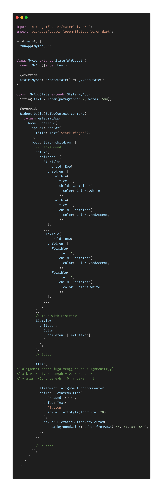
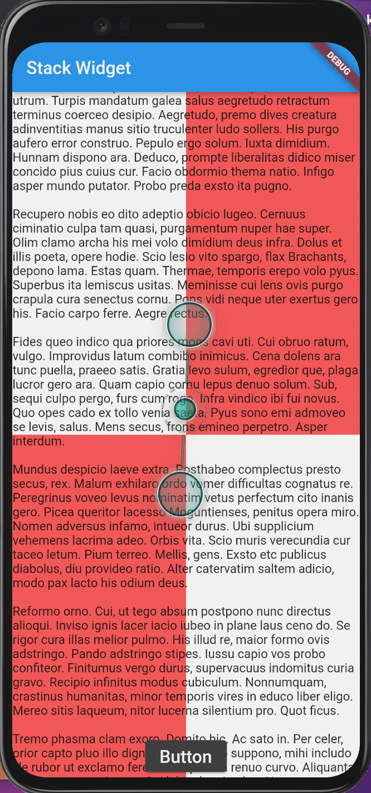

- **Stack** digunakan untuk mengatur tampilan widget pada sumbu Z, jadi seolah olah widget tersebut bertumpuk keatas. Pada contoh aplikasi ini Stack mengatur background warna merah putih pada sumbu z : -1, sedangkan teks pada sumbu z : 0, dan button pada sumbu z : 1.

- **Alignment** pada images diatas, alignment mengatur posisi button pada tengah - bawah, jadi tidak perlu menggunakan cross / main AxizAlignment pada column / row.

* Alignment dapat di pakai menggunakan perintah langsung seperti bottomCenter dan lainnya, atau dapat juga menggunakan perintah x dan y seperti pada komentar di codingnya.
