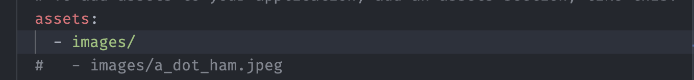
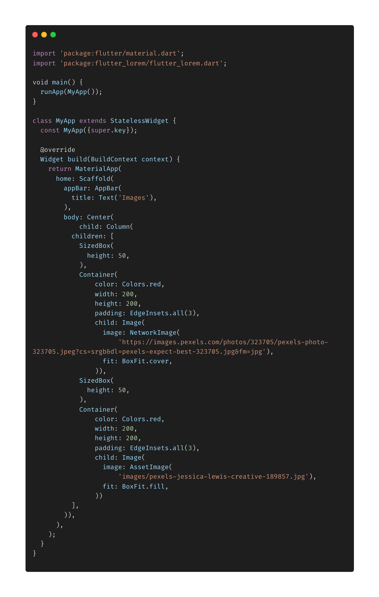
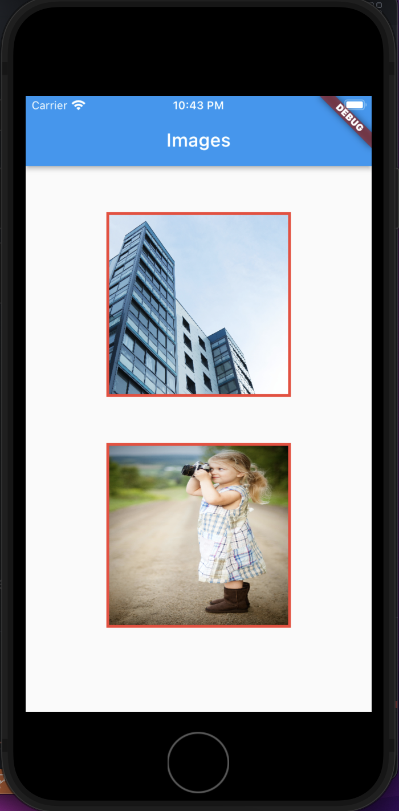

- **Image Widget** digunakan untuk insert image kedalam aplikasi, pada code dibawah menggunakan 2 cara :

1. Dengan menggunakan property NetworkImage, yaitu kita masukkan url dari image yang akan kita gunakan.

   > Image(image: NetworkImage(
   > 'https://images.pexels.com/photos/323705/pexels-photo-323705.jpeg?cs=srgb&dl=pexels-expect-best-323705.jpg&fm=jpg'),
   > fit: BoxFit.cover,

   property _fit_ diatas digunakan untuk mengatur posisi image nya.

2. Dengan menggunakan assets
   > Image( image: AssetImage('images/pexels-jessica-lewis-creative-189857.jpg'),
   > fit: BoxFit.fill,

- untuk menggunakan asset kita perlu

  - Membuat folder tempat menyimpan image yang ingin kita gunakan.
  - Daftarkan folder image tadi kedalam pubspec.yaml
    
  - Masukkan path tempat kita menyimpan image ( lihat contoh diatas).

  
  
