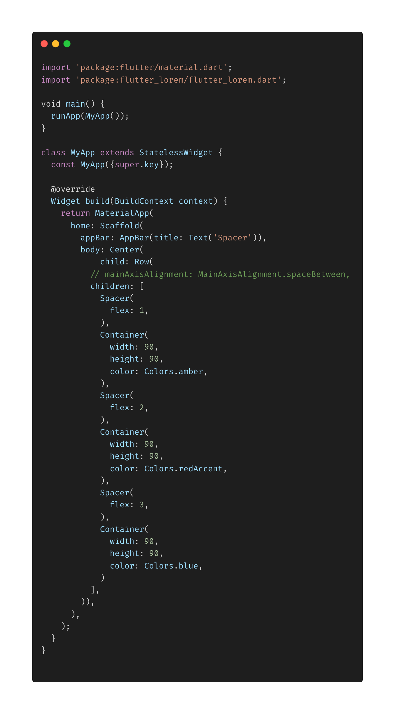
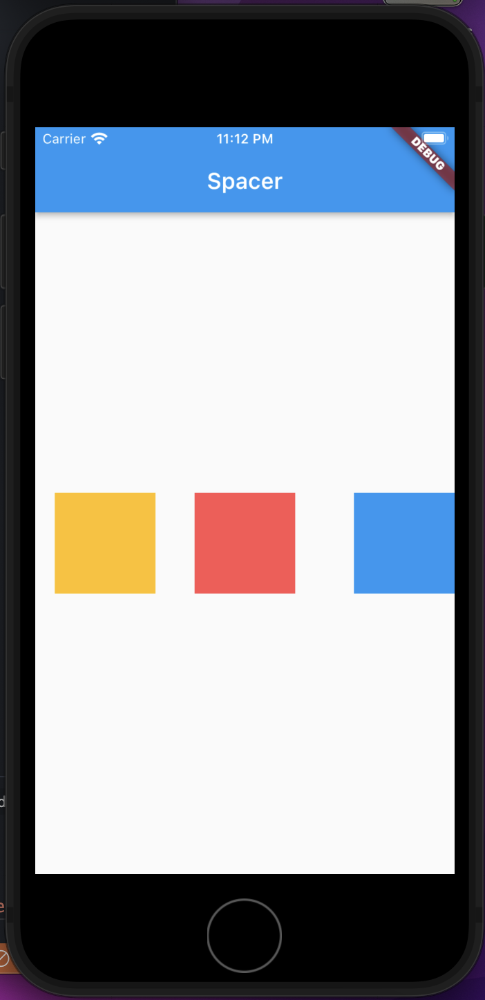

- **Spacer**
- Biasanya kita menggunakan main / cross AxisALignment untuk mengatur jarak pada column atau row.
- Pada contoh dibawah ini kita menggunakan _Spacer_ untuk memberikan jarak antar container, dan mengatur jaraknya menggunakan flex.

