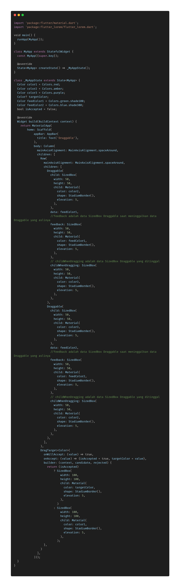
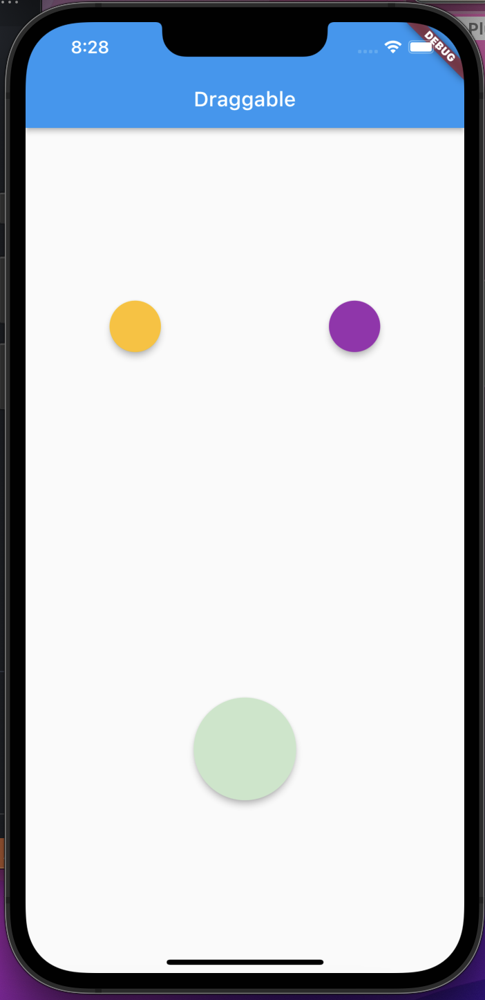

- **Draggable Widget** kita akan belajar membuat sebuah aplikasi dimana kita akan memindahkan sebuah object yang membawa data SizedBox.

* Pada code aplikasi kita, Data SizedBox yang asli dibungkus oleh widget _Draggable_ , widget _Draggable_ membutuhkan property child dan feedback.
* child akan menampung data yang membentuk SizedBox nya.
* feedback merupakan data SizedBox saat ditarik/didrag .
* kita bisa menambahkan property childWhenDragging yaitu data Draggable yang ditinggalkan oleh feedback.
* data adalah warna yang akan dipakai oleh feedback untuk merubah DragTarget.
* DragTarget memiliki 3 property yaitu : onWillAccept,onAccept,builder.
  \*\* sedangkan builder memilik 3 property yaitu context,candidate,rejected.

  
  
