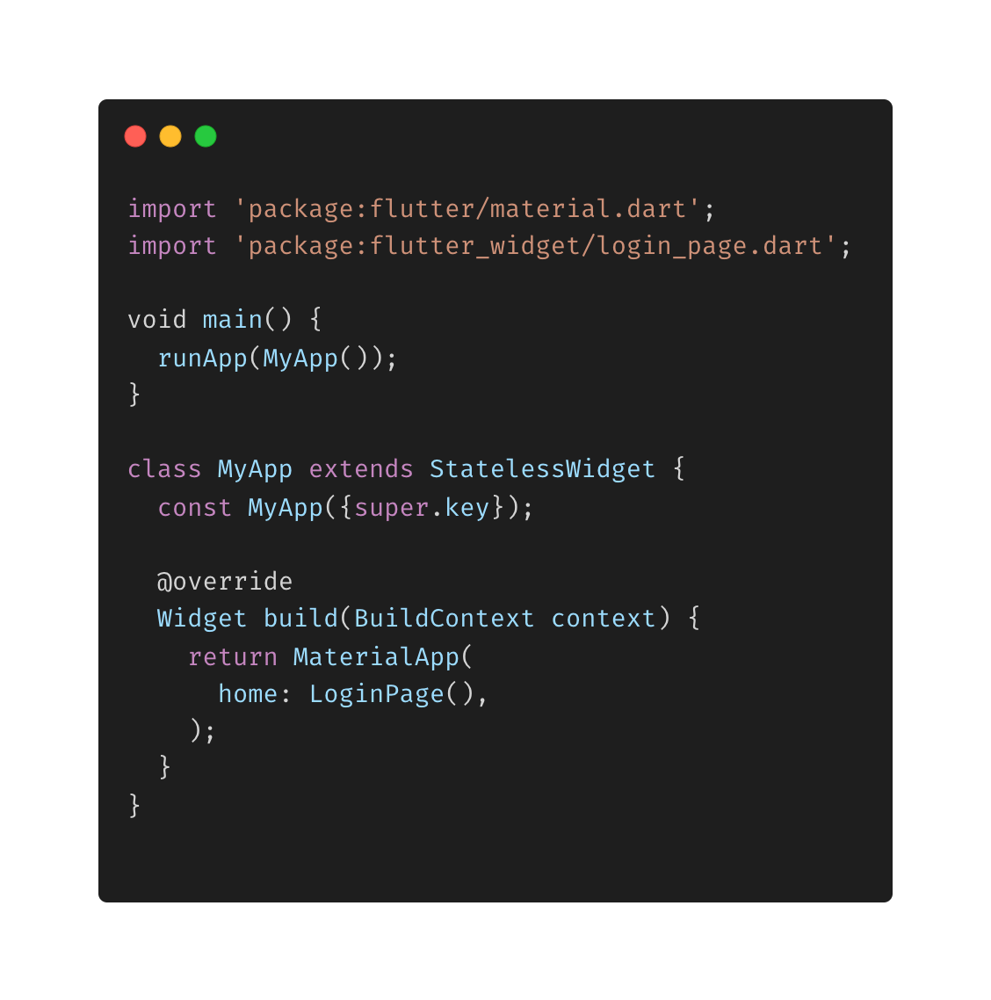
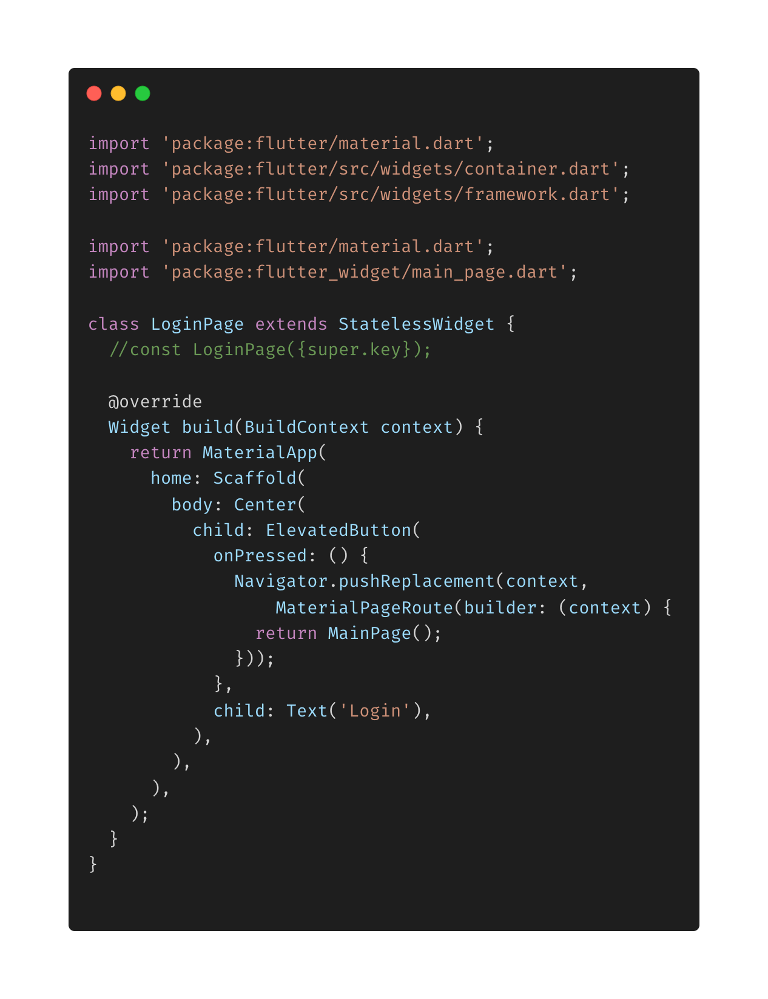
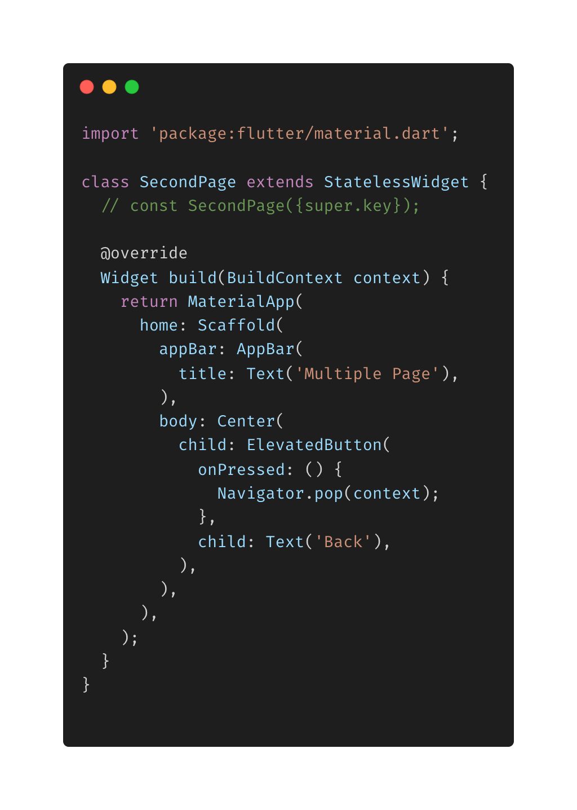
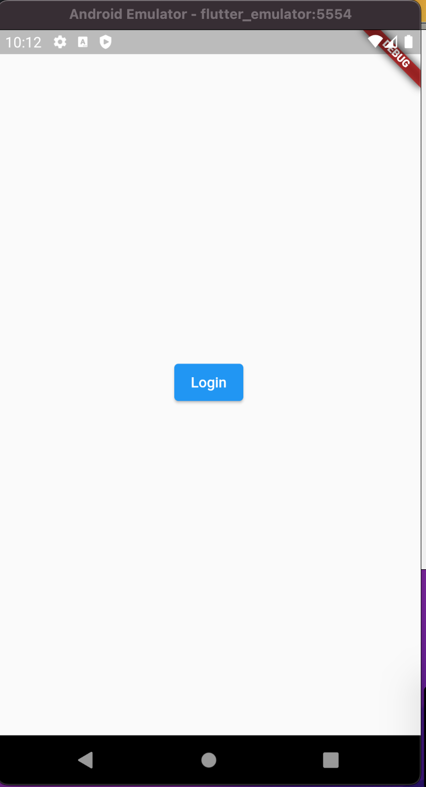

- Membuat Aplikasi dengan banyak halaman, sebaiknya dibuat pada file tersendiri setiap pagenya

* Kemudian nanti dihubungkan pada return MaterialApp nya.
* Pada code contoh aplikasi kita, Navigator berfungsi menghubungkan ke halaman lain
* Pada login_page menggunakan Navigator.pushReplacement karena setelah button login di tekan akan menuju ke main_page dan fungsi back menjadi dihilangkan.
* Pada main_page menggunakan Navigator.push karena setelah button 'Go to second page' ditekan akan menuju kehalaman second_page,tetapi halaman main_page masih bisa dikunjungi jika button back pada halaman second_page ditekan.
* Pada second_page menggunakan Navigator.pop yaitu berfungsi meletakkan kembali page sebelumnya, supaya bia dikunjungi kembali.

